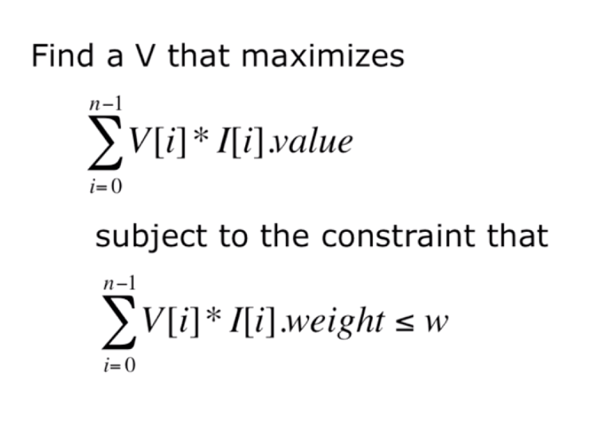

## Welcome ##

Computational Models:
* optimization models
* statistical models
* simulation models

## Lecture 1 - Optimization and the Knapsack Problem ##

What is an optimization model:
* An objective function that is to be maximized or minimized
* A set of constraints (possibly empty) that must be honored

__Takeaways__:
* many problems of real impact can be formulated as an optimization model
* reducing a seemingly new problem to an instance of well-known problem allows one to use pre-existing methods for solving them
* solving optimization problems is computationally challenging
* a greedy algorithm is often a practical approach to finding a pretty good _approximate_ solution to an optimization problem

#### Knapsack Problem ####

Two variants:
* 0/1 knapsack problem (harder)
* Continuous or fractional knapsack problem

##### 0/1 Knapsack Problem, Formalized #####
* Each item is represented by a pair, <value, weight>
* The knapsack can accommodate items with a total weight of no more than `w`
* A vector, `L`, of length n, represents the set of available items. Each element of the vector is an item.
* A vector, `V`, of length n, is used to indicate whether or not items are taken. If `V[i] = 1`, item `L[i]` is taken. If `V[i] = 0`, item `L[i]` is not taken.



##### Brute Force Algorithm #####
1. Enumerate all possible combinations of items. That is to say, generate all subsets of the set of subjects. This is called the **power set**.
2. Remove all of the combinations whose total units exceeds the allowed weight.
3. From the remaining combinations choose any one whose value is the largest.
* often not practical
* how big is the power set? 
	* `2^n` ~ algorithm is exponential
* how many possible different values can V have? 
	* As many different binary numbers as can be represented in n bits
* 0/1 knapsack problem is inherently exponential

**Exercise 1**:
1. Choose the item with the best value to weight ratio first.
	* The algorithm does not run
2. Choose the lighest object first
	* The algorithm runs and returns a non-optimal solution.
3. Choose the most valuable object first.
	* The algorithm runs and returns a non-optimal solution.

##### Greedy Algorithm #####

> while knapsack not full
> put "best" available item in knapsack

* What does best mean?
	* most valuable
	* least expensive
	* highest value/units

 Food   | wine  | beer | pizza | burger | fries | coke | apple | donut |
------- | ----- | ---- | ----- | ------ | ----- | ---- | ----- | ----- |
value   |   89  |  90  |  30   |   50   |   90  |  79  |  90   |   10  |
calories|  123  | 154  | 258   |   354  |  365  |  150 |  95   |  195  |

```python
class Food(object):
	def __init__(self, n, v, w):
		self.name = n
		self.value = v
		self.calories = w

	def getValue(self):
		return self.value

	def getCost(self):
		return self.calories

	def density(self):
		return self.getValue()/self.getCost()

	def __str__(self):
		return self.name + ': <' + str(self.value) + ', ' + str(self.calories) + '>'

def buildMenu(names, values, calories):
	"""	names, values, calories lists of same length.
		name a list of strings
		value and calories lists of numbers
		return list of Foods """
	menu = []
	for i in range(len(values)):
		menu.append(Food(names[i], values[i], calories[i]))
	return menu

def greedy(items, maxCost, keyFunction):
	"""	Assumes items a list, maxCost >= 0,
		keyFunction maps elements of items to numbers """
	itemsCopy = sorted(items, key = keyFunction, reverse = True)
	result = []
	totalValue, totalCost = 0.0, 0.0

	for i in range(len(items)):
		if (totalCost+itemsCopy[i].getCost()) <= maxCost:
			result.append(itemsCopy[i])
			totalCost += itemsCopy[i].getCost()
			totalValue += itemsCopy[i].getValue()

	return (result, totalValue)

def testGreedy(items, constraint, keyFunction):
	taken, val = greedy(items, constraint, keyFunction)
	print('Total value of items taken =', val)
	for item in taken:
		print('   ', item)

def testGreedys(foods, maxUnits):
	print('Use greedy by value to allocate', maxUnits, 'calories')
	testGreedy(foods, maxUnits, Food.getValue)
	print('\nUse greedy by cost to allocate', maxUnits, 'calories')
	testGreedy(foods, maxUnits, lambda x: 1/Food.getCost(x))
	print('\nUse greedy by density to allocate', maxUnits, 'calories')
	testGreedy(foods, maxUnits, Food.density)

names = ['wine', 'beer', 'pizza', 'burger', 'fries', 'cola', 'apple', 'donut', 'cake']
values = [89, 90, 95, 100, 90, 79, 50, 10]
calories = [123, 154, 258, 354, 365, 150, 95, 195]
foods = buildMenu(names, values, calories)
testGreedys(foods, 800)
```
**Greedy Algorithm Efficiency**:
* sorting is done in `n log n` where `n = len(items)` ~ lower boundary
* `for i in range(len(itemsCopy))` is `n`
* `n log n + n = n log n` which is (much less) `<< 2^n`

**Lambda Functions**:
* Used to create anonymous functions
* lambda <id1, id2, ..., idn> : <expression>
* returns a function of n arguments

```python
f1 = lambda x: x
f1(3)
f1('test')

f2 = lambda x, y: x + y
f2(2, 3)
f2('Hello', 'Program')

f3 = lambda x, y : 'factor' if (x%y == 0) else 'not factor'
f3(3, 6)
f3(3, 1)
```
**Why get different answers**?
* sequence of locally "optimal" choices don't always yield a globally optimal solution
* is greedy by density always a winner?
	* try testGreedys(foods, 1000)

**Pros & Cons of Greedy**
* easy to implement
* computationally efficient
* **but** does not always yield the best solution
	* don't even know how good the approximation is

**Exercise 2**:
1. computer, no more space
2. book, vase
3. vase, clock

**Exercise 3**:
1. O(n)
2. O(n^2)
3. O(2^n)

## Lecture 2 - Decision Trees and Dynamic Programming ##


------------------------------------------------------------------------------------------------------

## Lecture 2 - Decision Trees & Dynamic Programming ##

#### Brute Force Algorithms ####

Brute Force Algorithm:
* enumerate all possible combinations of items
* remove all the combinations whole total units exceeds the allowed weight
* from the remaining combinations choose any one whose value is the largest

**Search Tree/Decision Tree Implementation**:
* left-frist, depth-first enumeration
* left - YES
* right - NO  
**Computational Complexity**:
* time based on number of nodes generated
* number of levels = number of items to choose from
* number of nodes at level i is 2^i (exponential complexity)
* an obvious optimization: don't explore parts of tree that violate constraint but this _does not_ change complexity  
**Header for Decision Tree Implementation**
```python
def maxVal(toConsider, avail):
	''' Assumes toConsider a list of items, avail a weight
		Returns a tuple of the total value of a solution to 0/1 knapsack problem and the items of that solution
	'''
	# if there is nothing to consider or value is 0
	if toConsider == [] or avail = 0:
		result = (0, ())
	# however, first thing we're going to do is check the first item fits in the knapsack if first item won't fit in the knapsack I can assume I'm not going to take it and I go to the next item
	elif toConsider[0].getUnits() > avail:
		result = maxVal(toConsider[1:], avail)
	# if it does fit in the knapsack, I have to consider two branches: left where I take it, and right branch where I do not.
	else:
		nextItem = toConsider[0]
		withVal, withToTake = maxVal(toConsider[1:], avail - nextItem.getUnits())
		withVal += nextItem.getValue()
		withoutVal, withoutToTake = maxVal(toConsider[1:], avail)

		# choose the better of the two branches and return the results
		if withVal > withoutVal:
			result = (withVal, withToTake + (nextItem, ))
		else:
			result = (withoutVal, withoutToTake)
	return result
# We are not building the search tree. The local variable result records best solution found so far
```

##### Exercise 1 #####
```python
# generate all combinations of N items
def powerSet(items):
	N = len(items)
	# enumerate the 2**N possible combinations
	for i in range(2**N):
		combo = []
		for j in range(N):
			# test bit jth of integer i
			if (i >> j) % 2 == 1:
				combo.append(items[j])
		yield combo
```
Functions referenced in the grader:
```python
class Item(object):
	def __init__(self, n, v, w):
		self.name = n
		self.value = float(v)
		self.weight = float(w)
	def getName(self):
		return self.name
	def getValue(self):
		return self.value
	def getWeight(self):
		return self.weight
	def __str__(self):
		return '<' + self.name + ', ' + str(self.value) + ', '\
					 + str(self.weight) + '>'
def buildItems():
	return [Item(n,v,w) for n,v,w in (('clock', 175, 10), ('painting', 90, 9), ('radio', 20, 4), ('vase', 50, 2),('book', 10, 1),('computer', 200, 20))]

def buildRandomItems(n):
	return [Item(str(i),10*random.randint(1,10),random.randint(1,10))
			for i in range(n)]

def yieldAllCombos(items):
    N = len(items)
    # Enumerate the 3**N possible combinations   
    for i in range(3**N):
        bag1 = []
        bag2 = []
        for j in range(N):
            if (i // (3 ** j)) % 3 == 1:
                bag1.append(items[j])
            elif (i // (3 ** j)) % 3 == 2:
                bag2.append(items[j])
        yield (bag1, bag2)

items = buildItems()
combos = yieldAllCombos(items)
```

#### Recursive Fibonacci ####

**Dynamic Programming**

```python
def fib(n):
	if n == 0 or n == 1:
		return 1
	else:
		return fib(n - 1) + fib(n - 2) 
# time: O(n)
```

* Create a table to record what we've done
	* before computing fib(x), check if value of fib(x) already stored in the table
	* if so, look it up
	* if not, compute it and then add it to table
* Called **memoization**

**Using a Memo to Compute Fibonnaci**:
```python
def fastFib(n, memo = {}):
	'''	Assumes n is an int >= 0, memo used only by recursive calls
		Returns Fibonacci of n
	'''
	if n == 0 or n == 1:
		return 1
	try:
		return memo[n]
	except KeyError:
		result = fastFib(n-1, memo) + fastFib(n-2, memo)
		memo[n] = result
		return result
```

**When does dynamic programming work well?**
* Optimal substructure: a globally optimal solution can be found by computing optimal solutions to local subproblems
	* For x > 1, fib(x) = fib(x-1) + fib(x-2)
* Overlapping subproblems: finding an optimal solution involves solving the same problem multple times
	* Compute fib(x) or many times

#### Dynamic Programming ####

Dynamic programming can be used to solve a Knapsack problem:
* Add memo as a third argument: `def fastMaxVal(toConsider, avail, memo={})`
* Key of memo is a tuple
	* (items left to be considered, available weight)
	* items left to be considered represented by len(toConsider)
```python
def fastMaxVal(toConsider, avail, memo = {}):
	''' Assumes toConsider a list of items, avail a weight
		Returns a tuple of the total value of a solution to 0/1 knapsack problem and the items of that solution
	'''
	if (len(toConsider), avail) in memo:
		result = memo[(len(toConsider), avail) ]
	elif toConsider == [] or avail = 0:
		result = (0, ())
	elif toConsider[0].getUnits() > avail:
		# explore right branch only
		result = maxVal(toConsider[1:], avail, memo)
	else:
		nextItem = toConsider[0]
		# explore left branch
		withVal, withToTake = fastMaxVal(toConsider[1:], avail - nextItem.getUnits(), memo)
		withVal += nextItem.getValue()
		# explore right branch
		withoutVal, withoutToTake = fastMaxVal(toConsider[1:], avail, memo)

		# choose better branch
		if withVal > withoutVal:
			result = (withVal, withToTake + (nextItem, ))
		else:
			result = (withoutVal, withoutToTake)
		memo[(len(toConsider), avail)] = result
	return result
```

```python
# change recursion depth
import sys
sys.getrecursionlimit()
sys.setrecursionlimit(2000)
```

##### Exercise 2 #####

1. Dynamic programming can be used to solve optimization problems where the size of the space of possible solutions is exponentially large.  
**Answer**: True

2. Dynamic programming can be used to find an approximate solution to an optimization problem, but cannot be used to find a solution that is guaranteed to be optimal.  
**Answer**: False

3. Recall that sorting a list of integers can take `O(n log n` using an algorithm like merge sort. Dynamic programming can be used to reduce the order of algorithmic complexity of sorting a list of integers to something below `n log n`, where `n` is the length of the list to be sorted.  
**Answer**: False

4. Problem: I need to go up a flight of `N` stairs. I can either go up 1 or 2 steps every time. How many different ways are there for me to traverse these steps? For example:
```
3 steps -> could be 1,1,1 or 1,2 or 2,1
4 steps -> could be 1,1,1,1 or 1,1,2 or 1,2,1 or 2,1,1 or 2,2
5 steps -> could be 1,1,1,1,1 or 1,1,1,2 or 1,1,2,1 or 1,2,1,1 or 2,1,1,1 or 2,2,1 or 1,2,2 or 2,1,2
```
Does this problem have optimal substructure and overlapping subproblems?  
**Answer**: It has optimal substructure and overlapping subproblems

## Lecture 3 - Graph Problems ##

#### Graphs ####

Model road system using a digraph:
* nodes: points where roads end or meet
* edges: connetions between points
	* each edge has a weight indicating time it will take to get from source node to destination node for that edge

First reported use of graph theory:
* Bridges of Konigsberg (1735)
* Possible to take a walk that traverses each pf the 7 bridges exactly once?
Leonhard Euler's Model:
* each island a node
* each bridge an undirected edge
* is there a path that contains each edge exactly once? No!

##### Exercise 1 #####

1. A school's course catalog?    
**Answer**: B) Each vertex is a class, while a directional edge indicates that one class must come before another.

2. Students in a line?  
**Answer**: A) Vertices represent permutations of the students in line. Edges connect two permutations if one can be made into the other by swapping two adjacent students.

#### Graph Class ####

```python
class Node(object):
	def __init__(self, name):
		'''	Assumes name is a string '''
		self.name = name
	def getName(self):
		return self.name
	def __str__(self):
		return self.name

class Edge(object):
	def __init__(self, src, dest):
		'''	Assumes src and dest are nodes '''
		self.src = src
		self.dest = dest 
	def getSource(self):
		return self.src
	def getDestination(self):
		return self.dest 
	def __str__(self):
		return self.src.getName() + ' -> ' + self.dest.getName()
```

**Common Representations of Digraphs**:
* Adjacency matrix
	* rows: source nodes
	* columns: destination nodes
	* cell[s,d] = 1 if there is an edge from s to do, otherwise 0

* Adjacency list
	* associate with each node a list of destination nodes

```python
class Digraph(object):
	'''	edges is a dict mapping each node to a list of its children '''
	def __init__(self):
		self.edges = {}
	def addNode(self, node):
		if node in self.edges:
			raise ValueError('Duplicate node')
		else:
			self.edges[node] = []
	def addEdge(self, edge):
		src = edge.getSource()
		dest = edge.getDestination()
		if not (src in self.edges and dest in self.edges):
			raise ValueError('Node not in graph')
		self.edges[src].append(dest)
	def childrenOf(self, node):
		return self.edges[node]
	def hasNode(self, node):
		return node in self.edges
	def getNode(self, name):
		for n in self.edges:
			if n.getName() == name:
				return n 
		raise NameError(name)
	def __str__(self):
		result = ''
		for src in self.edges:
			for dest in self.edges[src]:
				result = result + src.getName() + ' -> ' + dest.getName() + '\n'
		return result[:-1] #omit final newline

class Graph(Digraph):
	def addEdge(self, edge):
		Digraph.addEdge(self, edge)
		rev = Edge(edge.getDestination(), edge.getSource())
		Digraph.addEdge(self, rev)
```

**Why is Graph a subclass of digraph?**  
_If client code works correctly using an instance of supertype, it should also work correctly when an instance of the subtype is substituted for the instance of the supertype_

**A classic graph optimization problem**  
```python
def buildCityGraph():
	g = Digraph()
	for name in ('Boston', 'Providence', 'New York'):
		g.addNode(Node(name))
	g.addEdge(Edge(g.getNode('Boston'), g.getNode('New York'))) # etc
```

##### Exercise 2 #####

```python
nodes = []
nodes.append(Node("ABC")) # nodes[0]
nodes.append(Node("ACB")) # nodes[1]
nodes.append(Node("BAC")) # nodes[2]
nodes.append(Node("BCA")) # nodes[3]
nodes.append(Node("CAB")) # nodes[4]
nodes.append(Node("CBA")) # nodes[5]

g = Graph()
for n in nodes:
    g.addNode(n)

''' bug - but potential
def permutations(node_name):
	result = []
	for i in range(2):
		node = list(node_name)
		if i == 0:
			node[0], node[1] = node[1], node[0]
		else:
			node[1], node[2] = node[2], node[1]
		result.append(''.join(node))
	return result

for node in nodes:
	perm = permutations(node.getName())
	for each in perm:
		try:
			print(Edge(g.getNode(each), node))
			#g.addEdge(Edge(g.getNode(each), node))
		except NameError:
			continue'''
g.addEdge(Edge(nodes[0], nodes[1]))
g.addEdge(Edge(nodes[0], nodes[2]))
g.addEdge(Edge(nodes[1], nodes[4]))
g.addEdge(Edge(nodes[2], nodes[3]))
g.addEdge(Edge(nodes[3], nodes[5]))
g.addEdge(Edge(nodes[4], nodes[5]))
```

#### Finding the Shortest Path ####

**Depth-first Search (DFS)**:  
* similar to left-first depth-first method of enumerating a search tree
* main difference is that graph might have cycles, so we must keep track of what nodes we have visited

```python
def DFS(graph, start, end, path, shortest):
	path = path + [start]
	if start == end:
		return path
	for node in graph.childrenOf(start):
		if node not in path: #avoid cycles
		if shortest == None:
			newPath = DFS(graph, node, end, path, shortest, toPrint)
			if newPath != None:
				shortest = newPath
	return shortest

def shortestPath(graph, start, end):
	return DFS(graph, start, end, [], None)
```

**Breadth-first Search (BFS)**:  
```python
def BFS(graph, start, end, toPrint = False):
	initPath = [start]
	pathQueue = [initPath]
	if toPrint:
		print('Current BFS path: ', printPath(pathQueue))
	while len(pathQueue) != 0:
		tmpPath = pathQueue.pop(0) # get and remove oldest element in pathQueue
		print('Current BFS path: ', printPath(tmpPath))
		lastNode = tmpPath[-1]
		if lastNode = end:
			return tmpPath
		for nextNode in graph.childrenOf(lastNode):
			newPath = tmpPath + [nextNode]
			pathQueue.append(newPath)
	return None
```

##### Exercise 3 #####

1. For questions 1 and 2, consider our previous problem (permutations of 3 students in a line).
When represented as a tree, each node will have how many children?  
**Answer**: 

2. Given two permutations, what is the maximum number of swaps it will take to reach one from the other?  
**Answer**: 3

3. For questions 3 and 4, consider the general case of our previous problem (permutations of n students in a line). Give your answer in terms of n.
When represented as a tree, each node will have how many children?  
**Answer**: n-1

4. Given two permutations, what is the maximum number of swaps it will take to reach one from the other?  
**Answer**: n * (n - 1) / 2

##### Exercise 4 #####

1. Source: 0 Destination: 4
**Answer**: 014

2. Source: 4 Destination: 1
**Answer**: 41

3. Source: 1 Destination: 1
**Answer**: 1

4. Source: 2 Destination: 4
**Answer**: 2014

5. Source: 2 Destination: 3
**Answer**: 201453

6. Source: 3 Destination: 1
**Answer**: 3201

##### Exercise 5 #####

1. How many edges are in **KN**?
**Answer**: `n * (n-1)/2`

2. Consider the new version of DFS. This traverses paths until all non-circular paths from the source to the destination have been found, and returns the shortest one.
Let A be the source node, and B be the destination in KN. How many paths of length 2 exist from A to B?
**Answer**: `n-2`

3. How many paths of length 3 exist from A to B?
**Answer**: `(n-3) * (n-2)`

4. Continuing the logic used above, calculate the number of paths of length  from A to B, where , and write this number as a ratio of factorials.
**Answer**: `fact(n-m+1) / fact(n-m-1)`

5. **Answer**: `fact(n-2)`

##### Exercise 6 #####

1. What is the asymptotic worst-case runtime of a Breadth First Search on KN? For simplicity, write O(n) as just n, O(n^2) as n^2, etc.
**Answer**: n

2. BFS will always run faster than DFS.
**Answer**: False

3. If a BFS and DFS prioritize the same nodes (e.g., both always choose to explore the lower numbered node first), BFS will always run at least as fast as DFS when run on two nodes in KN.
**Answer**: True

4. If a BFS and Shortest Path DFS prioritize the same nodes (e.g., both always choose to explore the lower numbered node first), BFS will always run at least as fast as Shortest Path DFS when run on two nodes in any connected unweighted graph.
**Answer**: True

5. Regardless of node priority, BFS will always run at least as fast as Shortest Path DFS on two nodes in any connected unweighted graph.
**Answer**: True

##### Exercise 7 #####

1. Consider once again our permutations of students in a line. Recall the nodes in the graph represent permutations, and that the edges represent swaps of adjacent students. We want to design a weighted graph, weighting edges higher for moves that are harder to make. Which of these could be easily implemented by simply assigning weights to the edges already in the graph?
**Answer**: A) A large student who is difficult to move around in line. B) A sticky spot on the floor which is difficult to move onto and off of.

2. Write a WeightedEdge class that extends Edge. Its constructor requires a weight parameter, as well as the parameters from Edge. You should additionally include a getWeight method. The string value of a WeightedEdge from node A to B with a weight of 3 should be "A->B (3)".
**Answer**: 
```python
class WeightedEdge(Edge):
    def __init__(self, src, dest, weight):
        Edge.__init__(self, src, dest)
        self.weight = weight

    def getWeight(self):
        return self.weight

    def __str__(self):
    	return '{}->{} ({})'.format(self.src.getName(), self.dest.getName(), self.weight)
```