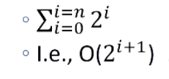

## Welcome ##

Computational Models:
* optimization models
* statistical models
* simulation models

## Lecture 1 - Optimization and the Knapsack Problem ##

What is an optimization model:
* An objective function that is to be maximized or minimized
* A set of constraints (possibly empty) that must be honored

__Takeaways__:
* many problems of real impact can be formulated as an optimization model
* reducing a seemingly new problem to an instance of well-known problem allows one to use pre-existing methods for solving them
* solving optimization problems is computationally challenging
* a greedy algorithm is often a practical approach to finding a pretty good _approximate_ solution to an optimization problem

#### Knapsack Problem ####

Two variants:
* 0/1 knapsack problem (harder)
* Continuous or fractional knapsack problem

##### 0/1 Knapsack Problem, Formalized #####
* Each item is represented by a pair, <value, weight>
* The knapsack can accommodate items with a total weight of no more than `w`
* A vector, `L`, of length n, represents the set of available items. Each element of the vector is an item.
* A vector, `V`, of length n, is used to indicate whether or not items are taken. If `V[i] = 1`, item `L[i]` is taken. If `V[i] = 0`, item `L[i]` is not taken.


##### Brute Force Algorithm #####
1. Enumerate all possible combinations of items. That is to say, generate all subsets of the set of subjects. This is called the **power set**.
2. Remove all of the combinations whose total units exceeds the allowed weight.
3. From the remaining combinations choose any one whose value is the largest.
* often not practical
* how big is the power set? 
	* `2^n` ~ algorithm is exponential
* how many possible different values can V have? 
	* As many different binary numbers as can be represented in n bits
* 0/1 knapsack problem is inherently exponential

**Exercise 1**:
1. Choose the item with the best value to weight ratio first.
	* The algorithm does not run
2. Choose the lighest object first
	* The algorithm runs and returns a non-optimal solution.
3. Choose the most valuable object first.
	* The algorithm runs and returns a non-optimal solution.

##### Greedy Algorithm #####

> while knapsack not full
> put "best" available item in knapsack

* What does best mean?
	* most valuable
	* least expensive
	* highest value/units

 Food   | wine  | beer | pizza | burger | fries | coke | apple | donut |
------- | ----- | ---- | ----- | ------ | ----- | ---- | ----- | ----- |
value   |   89  |  90  |  30   |   50   |   90  |  79  |  90   |   10  |
calories|  123  | 154  | 258   |   354  |  365  |  150 |  95   |  195  |

```python
class Food(object):
	def __init__(self, n, v, w):
		self.name = n
		self.value = v
		self.calories = w

	def getValue(self):
		return self.value

	def getCost(self):
		return self.calories

	def density(self):
		return self.getValue()/self.getCost()

	def __str__(self):
		return self.name + ': <' + str(self.value) + ', ' + str(self.calories) + '>'

def buildMenu(names, values, calories):
	"""	names, values, calories lists of same length.
		name a list of strings
		value and calories lists of numbers
		return list of Foods """
	menu = []
	for i in range(len(values)):
		menu.append(Food(names[i], values[i], calories[i]))
	return menu

def greedy(items, maxCost, keyFunction):
	"""	Assumes items a list, maxCost >= 0,
		keyFunction maps elements of items to numbers """
	itemsCopy = sorted(items, key = keyFunction, reverse = True)
	result = []
	totalValue, totalCost = 0.0, 0.0

	for i in range(len(items)):
		if (totalCost+itemsCopy[i].getCost()) <= maxCost:
			result.append(itemsCopy[i])
			totalCost += itemsCopy[i].getCost()
			totalValue += itemsCopy[i].getValue()

	return (result, totalValue)

def testGreedy(items, constraint, keyFunction):
	taken, val = greedy(items, constraint, keyFunction)
	print('Total value of items taken =', val)
	for item in taken:
		print('   ', item)

def testGreedys(foods, maxUnits):
	print('Use greedy by value to allocate', maxUnits, 'calories')
	testGreedy(foods, maxUnits, Food.getValue)
	print('\nUse greedy by cost to allocate', maxUnits, 'calories')
	testGreedy(foods, maxUnits, lambda x: 1/Food.getCost(x))
	print('\nUse greedy by density to allocate', maxUnits, 'calories')
	testGreedy(foods, maxUnits, Food.density)

names = ['wine', 'beer', 'pizza', 'burger', 'fries', 'cola', 'apple', 'donut', 'cake']
values = [89, 90, 95, 100, 90, 79, 50, 10]
calories = [123, 154, 258, 354, 365, 150, 95, 195]
foods = buildMenu(names, values, calories)
testGreedys(foods, 800)
```
**Greedy Algorithm Efficiency**:
* sorting is done in `n log n` where `n = len(items)` ~ lower boundary
* `for i in range(len(itemsCopy))` is `n`
* `n log n + n = n log n` which is (much less) `<< 2^n`

**Lambda Functions**:
* Used to create anonymous functions
* lambda <id1, id2, ..., idn> : <expression>
* returns a function of n arguments

```python
f1 = lambda x: x
f1(3)
f1('test')

f2 = lambda x, y: x + y
f2(2, 3)
f2('Hello', 'Program')

f3 = lambda x, y : 'factor' if (x%y == 0) else 'not factor'
f3(3, 6)
f3(3, 1)
```
**Why get different answers**?
* sequence of locally "optimal" choices don't always yield a globally optimal solution
* is greedy by density always a winner?
	* try testGreedys(foods, 1000)

**Pros & Cons of Greedy**
* easy to implement
* computationally efficient
* **but** does not always yield the best solution
	* don't even know how good the approximation is

**Exercise 2**:
1. computer, no more space
2. book, vase
3. vase, clock

**Exercise 3**:
1. O(n)
2. O(n^2)
3. O(2^n)

## Lecture 2 - Decision Trees and Dynamic Programming ##

#### Brute Force Algorithms ####

##### Search Tree Implementation #####
* the tree is build top down starting with the root
* the first element is selected from the still to be considered items
	* if there is room for that item in the knapsack, a node is constructed that reflects the consequence of choosing to take that item. By convention, we draw that as the left chid
	* we also explore the consequences of not taking that items. this is the right child
* the process is then applied recursively to non-leaf children (aka decision trees or search trees)
* finally choose the node with the highest value
* left-frist, depth-first enumeration
* left - YES (to take food)
* right - NO  (not take food)
* **we're guaranteed to have an optimal solution because we look at all possible solutions**

Computation required to build a search trees:
* time based on number of nodes generated (look at the number of levels and nodes per level)
* number of level is number of items to choose from
* number of nodes at level i is `2^i`
* So, if there are n items the number of nodes is: 

* Computational complexity is `O( 2^(i+1) )`
* an obvious optimization is to not explore the parts of the tree that violate constrains
	* does not change the computational complexity

```python
def maxVal(toConsider, avail):
	""" Assumes toConsider a list of items,
			avail a weight
		Returns a tuple of the total value of a 
			solution to 0/1 knapsack problem 
			and the items of that solution"""
	if toConsider == [] or avail == 0:
		result = (0, ()) # no value and no items

	elif toConsider[0].getCost() > avail:
		result = maxVal(toConsider[1:], avail) # pass cuz units greater than what's available

	else:
		nextItem = toConsider[0]
		# Explore left branch
		withVal, withToTake = maxVal(toConsider[1:], avail - nextItem.getCost())
		withVal += nextItem.getValue()

		# Explore right branch
		withoutVal, withoutToTake = maxVal(toConsider[1:], avail)

		# Explore better branch
		if withVal > withoutVal:
			result = (withVal, withToTake + (nextItem,))
		else:
			result = (withoutVal, withoutToTake)
	return result
```
* above we're not actually building the search tree
* the local variable `result` records best solution found so far

__Search Tree Worked Great__
* Gave us a better answer
* Finished quickly
* But `2^8` is not a large number
	* We should look at what happens when we have a more extensive menu to choose from

**Exercise 1**
```python
# generate all combinations of N items
def powerSet(items):
	N = len(items)
	# enumerate the 2**N possible combinations
	for i in range(2**N):
		combo = []
		for j in range(N):
			# test bit jth of integer i
			if (i >> j) % 2 == 1: # i >> j == i // (2^j)
				combo.append(items[j])
		yield combo

def yieldAllCombos(items):
	"""
	  Generates all combinations of N items into two bags, whereby each 
	  item is in one or zero bags.

	  Yields a tuple, (bag1, bag2), where each bag is represented as 
	  a list of which item(s) are in each bag.
	"""
	N = len(items)
	# enumerate the 2**N possible combinations
	for i in range(3**N):
		combo1, combo2 = [], []
		for j in range(N):
			if (i // (3**j)) % 3 == 1:
				combo1.append(items[j])
			elif (i // (3**j)) % 3 == 2:
				combo2.append(items[j])
		yield (combo1, combo2)

# items:
names = ['wine', 'beer', 'pizza', 'burger', 'fries', 'cola', 'apple', 'donut', 'cake']

foo = yieldAllCombos(names)
for i in range(3**(len(names))):
	foo.__next__()
```

##### Call Tree for Recursive Fibonnaci(6) = 13 #####

```python
import random

def buildLargeMenu(numItems, maxVal, maxCost):
	items = []
	for i in range(numItems):
		items.append(Food(str(i), random.randint(1, maxVal), random.randint(1, maxCost)))
	return items

for numItems in (5, 10, 15, 20, 25, 30, 35, 40, 45):
	items = buildLargeMenu(numItems, 90, 250)
	testMaxVal(items, 750, False)
```

**Dynamic Programming**
* sometime a name is just a name
> The 1950s were not good years for mathematical research... I felt I had to do something to shield 
> Wilson and the Air Force from the fact that I was really doing mathematics... What title, what name, 
> could I choose?... it’s impossible to use the word, dynamic, in a pejorative sense. Try thinking of 
> some combination that will possibly give it a pejorative meaning. It’s impossible. Thus, I thought 
> dynamic programming was a good name. It was something not even a Congressman could object to. So I 
> used it as an umbrella for my activities.

```python
def fib(n):
	if n == 0 or n == 1:
		return 1
	else:
		return fib(n - 1) + fib(n - 2)
fib(120)
```
**Memoization**: record the value returned by the first time we call a method(x); and then, look it up rather than compute it each time.
	* trade a time for space
	* create a table to record what we've done
		* ex: before computing fib(x), check if value of fib(x) already stored in the table
		* if so, look it up
		* if not, compute it and add it to table

```python
# Using Memoization to Compute Fibonnaci
def fastFib(n, memo = {}):
	"""	Assumes n is an int >= 0, memo used only by recursive calls
		Returns Fibonnaci of n"""
	if n == 0 or n == 1:
		return 1
	try:
		return memo[n]
	except KeyError:
		result = fastFib(n - 1, memo) + fastFib(n-2, memo)
		memo[n] = result
		return result
```
__When does it work?__
* Optimal substructure: a globally optimal solution can be found by combining optimal solutions to local subproblems
	* for x > 1, fib(x) = fib(x - 1) + fib(x - 2)
* Overlapping subproblems: finding an optimal solution involves solving the same problem multiple times
	* compute fib(x) many times

##### Dynamic Programming #####

For the 0/1 knapsack problem, it has an optimal substructure but we're computing different things every time so it does not have overlapping subproblems. We can run a dynamic programming algorithm on the 0/1 knapsack problem but it wouldn't give us any speedup.  
If the knapsack problem includes duplicate items, then yes, it has overlapping subproblems.  


If we look at the 0/1 knapsack problem and we're only worried about the weight leftover, we notice that this problem also has overlapping subproblems. We can, then, modify `maxVal` to use memoization:
	* add memo as a third argument: `def fastMaxVal(toConsider, avail, memo={}):`
	* key of memo is a tuple:
		* (items left to be considered, available weight)
		* items left to be considered represented by len(toConsider)
	* first thing body of function does is check whether the optimal choice of items given the available weight is already in the memo
	* last thing body of function does is update the memo
```python
def fastMaxVal(toConsider, avail, memo = {}):
	"""	Assumes toConsider a list of subjects, avail a weight
			memo supplied by recursive calls
		Returns a tuple of the total value of a solution to the 
			0/1 knapsack problem and the subjects of that solution"""
	if (len(toConsider), avail) in memo:
		result = memo[(len(toConsider), avail)]
	elif toConsider == [] or avail == 0:
		result = (0, ())
	elif toConsider[0].getCost() > avail:
		# explore right branch only
		result = fastMaxVal(toConsider[1:], avail, memo)
	else:
		nextItem = toConsider[0]
		# explore left branch
		withVal, withToTake = fastMaxVal(toConsider[1:], avail - nextItem.getCost(), memo)
		withVal += nextItem.getValue()
		# explore right branch
		withoutVal, withoutToTake = fastMaxVal(toConsider[1:], avail, memo)

		# choose better branch
		if withVal > withoutVal:
			result = (withVal, withToTake + (nextItem,))
		else:
			result = (withoutVal, withoutToTake)
	memo[(len(toConsider), avail)] = result
	return result

# rewrote testMaxVal method
def testMaxVal(foods, maxUnits, algorithm, printItems = True):
	print('Menu contains', len(foods)m 'items')
	print('Use search tree to allocate', maxUnits, 'calories')
	val, taken = algorithm(foods, maxUnits)
	if printItems:
		print('Total value of items taken =', val)
		for item in taken:
			print('   ', item)
```
* Problem is exponential
* Have we overturned the laws of the universe?
* Is dynamic programming a miracle?
* No, but computational complexity can be subtle
* Running time of fastMaxVal is governed by numbers of distinct pairs, <toConsider, avail>
	* Number of possible values of toConsider bounded by len(items)
	* Possible values of avail a bit harder to characterize
		* Bounded by number of distinct sums of weights
	* Covered in more detail in assigned reading

__Summary of Lectures 1-2__:
* Many problems of practical importance can be formulated as **optimization problems**
* **Greedy algorithms** often provide adequate (though not necessarily optimal) solutions
* Finding an optimal solution is usually **exponentially hard**
* But **dynamic programming** often yields good performance for a subclass of optimization problems - those with optimal substructure and overlapping subproblems
	* solution always correct
	* fast under the right circumstances

**Exercise 2**
1. Dynamic programming can be used to solve optimization problems where the size of the space of possible solutions is exponentially large. **TRUE**
2. Dynamic programming can be used to find an approximate solution to an optimization problem, but cannot be used to find a solution that is guaranteed to be optimal. **FALSE**
3. Recall that sorting a list of integers can take `𝑂(𝑛log𝑛)` using an algorithm like merge sort. Dynamic programming can be used to reduce the order of algorithmic complexity of sorting a list of integers to something below  `𝑛log𝑛` , where `n` is the length of the list to be sorted. **FALSE**
4. I need to go up a flight of  𝑁  stairs. I can either go up 1 or 2 steps every time. How many different ways are there for me to traverse these steps? Does this problem have optimal substructure and overlapping subproblems? **It has optimal substructure and overlapping subproblems**

## Lecture 3 - Graph Problems ##

Recap: **Computational Models** are programs that help us understand the world and solve practical problems  
**What's a Graph**?
* a set of nodes (vertices)
	* might have properties associated with them
* set of edges (arcs) each consisting of a pair of nodes
	* undirected (graph)
	* directed (digraph)
		* sourse (parent) and destination (child) nodes
	* unweighted or weighted
**Why Graphs**?
* to capture useful relationships among entities
	* rail links between Paris and London
	* how the atoms in a molecule related to one another
	* ancestral relationship
**Trees: An Important Special Case**:
* a directed graph in which each pair of nodes is connected by a single path
	* recall the search trees we used to solve knapsack problem
**Getting John to the Office**:
* nodes: points where roads end or meet
* edges: connections between points
	* each edge has a weight indicating time it will take to get from source node to destination node for that edge
* solve a graph optimization problem
	* shorted weighted path between my house and my office

**Leonhard Euler's Model - Konigsberg Bridge Problem**:
* each island a node
* each bridge an undirected edge
* model abstracts away irrelevant details
	* size of island
	* length of bridge
* is there a path that contains each edge exactly once?

**Exercise 1**
1. Each vertex is a class, while a directional edge indicates that one class must come before another.
2. Vertices represent permutations of the students in line. Edges connect two permutations if one can be made into the other by swapping two adjacent students.

##### Graph Class #####

```python
class Node(object):
	def __init__(self, name):
		""" Assumes name is a string"""
		self.name = name

	def getName(self):
		return self.name

	def __str__(self):
		return self.name


class Edge(object):
	def __init__(self, src, dest):
		""" Assumes src and dest are nodes"""
		self.src = src
		self.dest = dest

	def getSource(self):
		return self.src

	def getDestination(self):
		return self.dest

	def __str__(self):
		return self.src.getName() + ' -> ' + self.dest.getName()
```

**Common Representations of Digraphs**:
* Adjacency matrix
	* rows: source nodes
	* columns: destination nodes
	* cell[s,d] = 1 if there is an edge from s to do, 0 otherwise
* Adjacency list
	* associate with each node a list of destination nodes

```python
class Digraph(object):
	""" edges is a dict mapping each node to a list of its children """
	def __init__(self):
		self.edges = {}

	def addNode(self, node):
		if node in self.edges:
			raise ValueError('Duplicate node')
		else:
			self.edges[node] = []

	def addEdge(self, edge):
		src = edge.getSource()
		dest = edge.getDestination()
		if not (src in self.edges and dest in self.edges):
			raise ValueError('Node not in graph')
		self.edges[src].append(dest)

	def childrenOf(self, node):
		return self.edges[node]

	def hasNode(self, node):
		return node in self.edges

	def getNode(self, name):
		for n in self.edges:
			if n.getName() == name:
				return n
		raise NameError(name)

	def __str__(self):
		result = ''
		for src in self.edges:
			for dest in self.edges[src]:
				result = result + src.getName() + ' -> ' + dest.getName() + '\n'
		return result[:-1] # omit final newline

class Graph(Digraph):
	""" Any program that works with a digraph will also work with a graph, but not vice versa.
	"""

	def addEdge(self, edge): #overwrite the add
		Digraph.addEdge(self, edge)
		rev = Edge(edge.getDestination(), edge.getSource())
		Digraph.addEdge(self, rev)
```

**Why is Graph a subclass of digraph**?
* If client code works correctly using an instance of the supertype, it should also work correctly when an instance of the subtrype is substituted for the instance of the supertype.  
**A classic Graph Optimization Problem**:
* Shortest path from n1 to n2
	* shortest sequence of edges such that
		* source node of first edge is n1
		* destination of last edge is n2
		* for edges, e1 and e2, in the sequence, if e2 follows e1 in the sequence, the source of e2 is the destination of e1
* Shortest weighted path
	* Minimize the sum of the weights of the edges in the path

```python
def buildCityGraph():
	g = Digraph()
	for name in ('Boston', 'Providence', 'New York', 'Chicago', 'Denver', 'Phoenix', 'Los Angeles'):
		g.addNode(Node(name))
	g.addEdge(Edge(g.getNode('Boston'), g.getNode('Providence')))
	g.addEdge(Edge(g.getNode('Boston'),g.getNode('New York')))
	g.addEdge(Edge(g.getNode('Providence'),g.getNode('Boston')))
	g.addEdge(Edge(g.getNode('Providence'),g.getNode('New York')))
	g.addEdge(Edge(g.getNode('New York'),g.getNode('Chicago')))
	g.addEdge(Edge(g.getNode('Chicago'),g.getNode('Denver')))
	g.addEdge(Edge(g.getNode('Denver'),g.getNode('Phoenix')))
	g.addEdge(Edge(g.getNode('Denver'),g.getNode('New York')))
	g.addEdge(Edge(g.getNode('Chicago'),g.getNode('Phoenix')))
	g.addEdge(Edge(g.getNode('Los Angeles'),g.getNode('Boston')))

```

**Exercise 2**
```python
nodes = []
nodes.append(Node("ABC")) # nodes[0]
nodes.append(Node("ACB")) # nodes[1]
nodes.append(Node("BAC")) # nodes[2]
nodes.append(Node("BCA")) # nodes[3]
nodes.append(Node("CAB")) # nodes[4]
nodes.append(Node("CBA")) # nodes[5]

g = Graph()
for n in nodes:
	g.addNode(n)

g.addEdge(Edge(nodes[0], nodes[1]))
g.addEdge(Edge(nodes[0], nodes[2]))
g.addEdge(Edge(nodes[1], nodes[4]))
g.addEdge(Edge(nodes[2], nodes[3]))
g.addEdge(Edge(nodes[3], nodes[5]))
g.addEdge(Edge(nodes[4], nodes[5]))
```

##### Finding the Shortest Path #####

##### Depth-first search (DFS) #####

* similar to left-first depth-first method of enumerating a search tree (Lecture 2)
* main difference is that graph might have cycles, so we must keep track of what nodes we have visited

```python
def printPath(path):
	""" Assumes path is a list of nodes """
	result = ''
	for i in range(len(path)):
		result = result + str(path[i])
		if i != len(path) - 1:
			result = result + ' --> '
	return result

def DFS(graph, start, end, path, shortest, toPrint = False):
	""" Assumes graph is a Digraph; start and end are nodes;
			path and shortest are lists of nodes
		Returns a shortest path from start to end in graph """
	path = path + [start]

	if toPrint:
		print('Current DFS path:', printPath(path))
	if start == end:
		return path
	for node in graph.childrenOf(start):
		if node not in path: # avoid cycles
			if (shortest == None) or (len(path) < len(shortes)):
				newPath = DFS(graph, node, end, path, shortest, toPrint)
				if newPath != None:
					shortest = newPath
		elif toPrint:
			print('Already visited', node)
	return shortest

def shortestPath(graph, start, end):
	""" Assumes graph is Digraph; start and end are nodes;
		Returns a shortest path from start to end in graph """
	return DFS(graph, start, end, [], None)

def testSP(source, destination):
	g = buildCityGraph(Digraph)
	sp = shortestPath(g, g.getNode(source), g.getNode(destination), toPrint = True)

	if sp != None:
		print('Shortest path from', source, 'to', destination, 'is', printPath(sp))
	else:
		print('There is no path from', source, 'to', destination)
```

##### Breadth-first search (BFS) #####

```python
def BFS(graph, start, end, toPrint = False):
	initPath = [start]
	pathQueue = [initPath]

	if toPrint:
		print('Current BFS path:', printPath(pathQueue))

	while len(pathQueue) != 0:
		# Get and remove oldest element in pathQueue
		tmpPath = pathQueue.pop(0)
		if toPrint:
			print('Current BFS path:', printPath(tmpPath))
		lastNode = tmpPath[-1]
		if lastNode == end:
			return tmpPath
		for nextNode in graph.childrenOf(lastNode): ### ERROR
			if nextNode not in tmpPath:
				newPath = tmpPath + [nextNode]
				pathQueue.append(newPath)
	return None
```

**What About a Weighted Shortest Path**?
* want to minimize the sum of the weights of the edges, not the number of edges
* DFS can be easily modified to do this 
* BFS cannot because what we're doing in breadth first search is we're enumerating the paths in length order not in weighted order (not in the sum of the weights)

**Recap**:
* Graphs are cool
	* Best way to create a model of many things
		* capture relationships among objects
	* Many important problems can be posed as graph optimization problems we already know how to solve
* Depth-first and breadth-first search are important algorithms
	* Can be used to solve many problems

**Exercise 3**:
1. 2
2. 3 (total number of nodes / 2)
3. n - 1
4. n * (n - 1) / 2

**Exercise 4**:
1. 014
2. 41
3. 1
4. 2014
5. 201453
6. 3201
7. 2/3 		*Explanation*: First, realize that the structure of this graph is a set of six nodes, all connected in a circle. Each node has two edges that connect it to adjacent nodes. Given any node, we know that DFS will prioritize the lower-numbered neighbor. Thus, for any destination, we first check for paths along this side. If our destination is our source, we terminate the DFS, and return a path of length zero, which is clearly the shortest. Otherwise, we continue in a circle in one direction. We cannot change direction once we have begun to traverse the circle, as the path may not include any node more than once. It will have found the shortest path for the nodes that are 0, 1, 2, or 3 edges away, but will yield paths of length 4 and 5 for the last two nodes that are, in reality, 2 and 1 edges away, respectively. As it has found the shortest path for 4 nodes, but not for 2, the probability is 4 in 6, or 2/3.

**Exercise 5**:
1. n * (n - 1) / 2
2. n - 2
3. (n - 2) * (n - 3)  		*Explanation*: (n-3) nodes on the first path, (n-2) for every (n-3) node paths, so answer is (n-3) * (n-2)
4. fact(n - m + 1) / fact(n - m - 1)  		*Explanation*: (n-2) * (n-3) = (n-2)! / (n-4)! for finding paths of length 3. This can be written as: (n - (3 -1))! / (n - (3 + 1))!. So for length m = (n - (m -1))! / (n - (m + 1))! = (n - m + 1)! / (n - m - 1)!
5. fact(n - 2)  		*Explanation*: see answer from exercise.

**Exercise 6**:
1. n   		*Explanation*: BFS begins by checking all the paths of length 1. In its worst case, it must check the paths to every node from the source to find the destination. This is at most,  𝑛−1  checks.
2. False   		*Explanation*: Consider a graph of two nodes, A and B, connected by an edge. You wish to search for a path from A to B. As there is exactly one edge in the graph, and exactly one path from A to B, both run in an equal number of steps.
3. True   		*Explanation*: As seen in our previous problems in this lecture sequence, BFS checks at most  𝑛−1  paths in KN, and DFS always checks  𝑂((𝑛−2)!)  paths. If given the same node prioritization, both will first find the desired node in the same number of steps.
4. True   		*Explanation*: While Shortest Path DFS may find the desired node first in this case, it still must explore all other paths before it has determined which path is the fastest. BFS will explore only a fraction of the paths.
5. True   		*Explanation*: Shortest Path DFS must always explore every path from the source to the destination to ensure that it has found the shortest path. Once BFS has found a path, it knows that it is the shortest, and does not have to explore any other paths.

**Exercise 7**:
1. Consider once again our permutations of students in a line. Recall the nodes in the graph represent permutations, and that the edges represent swaps of adjacent students. We want to design a weighted graph, weighting edges higher for moves that are harder to make. Which of these could be easily implemented by simply assigning weights to the edges already in the graph?
**Answer**: A) A large student who is difficult to move around in line. B) A sticky spot on the floor which is difficult to move onto and off of.
2. 
```python
class WeightedEdge(Edge):
	def __init__(self, src, dest, weight):
		Edge.__init__(self, src, dest)
		self.weight = weight

	def getWeight(self):
		return self.weight

	def __str__(self):
		return  self.src.getName() + '->' + self.dest.getName() + ' (' + str(self.weight) + ')'
```