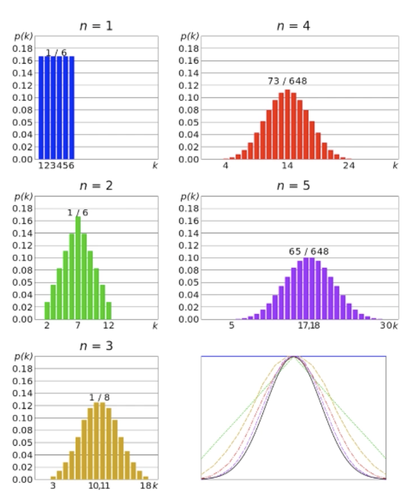
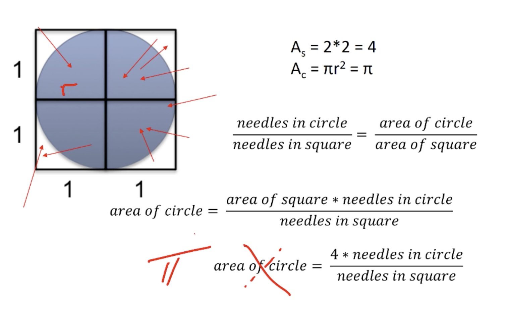
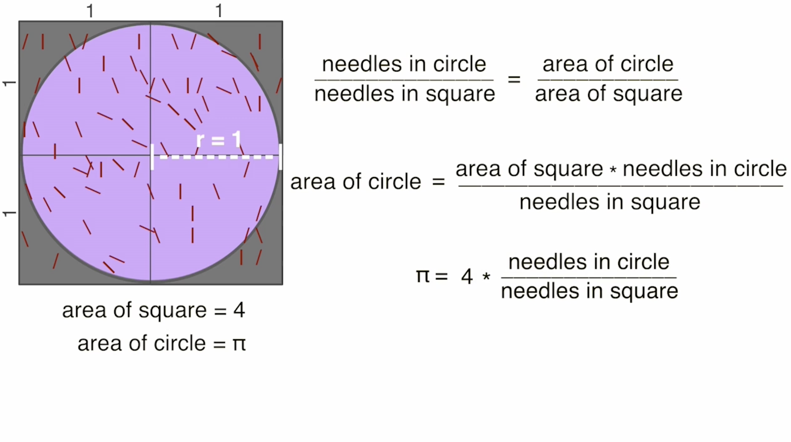
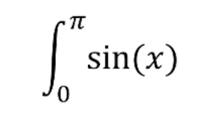
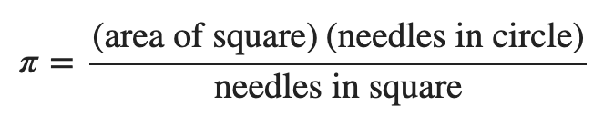
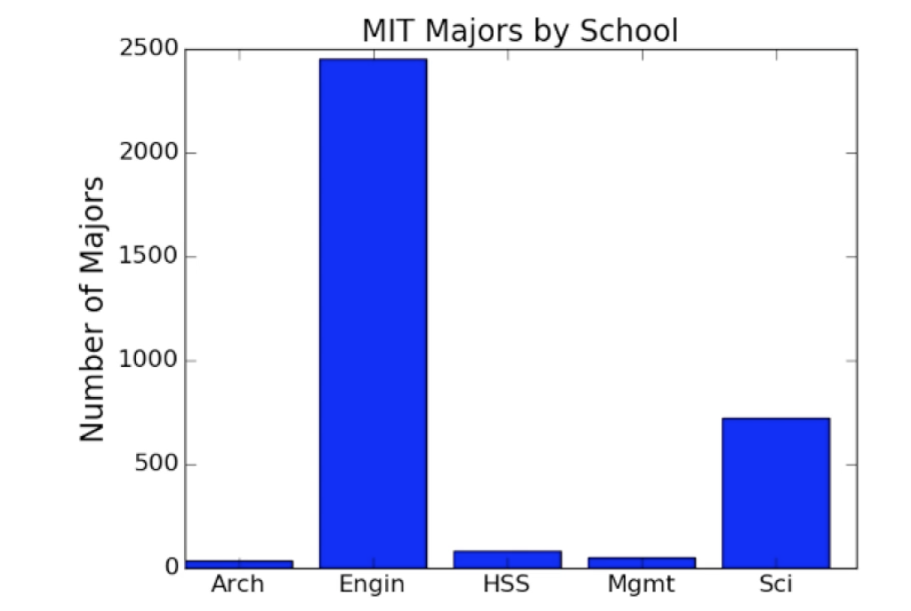
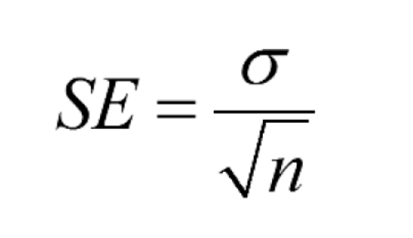
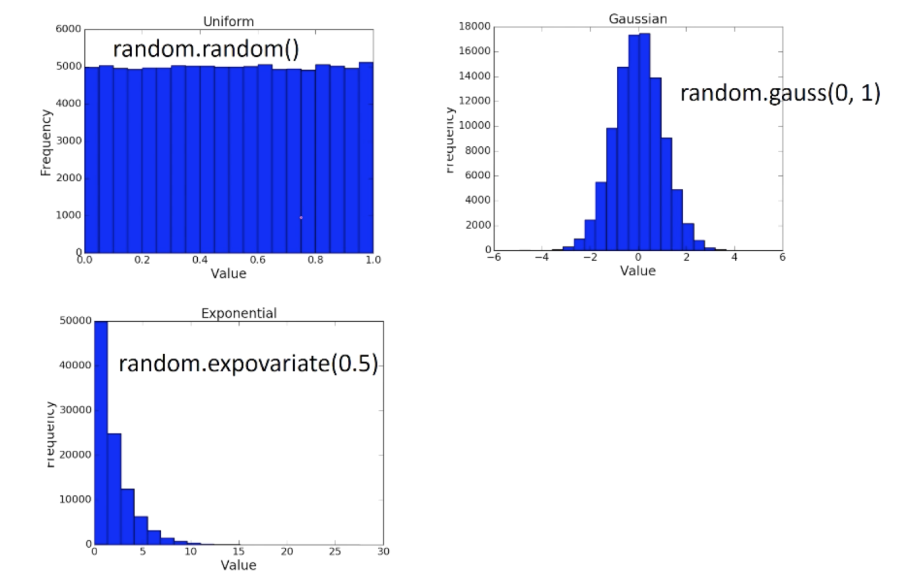

## Unit 3 ##

### Inferential Statistics ###
* Population: a set of examples
* Sample: a proper subset of a population
* Goal: estimate some statcitic about the population based on statistics about the sample
* Key fact: If the sample is **random**, it tends to exhibit the same properties as the population from which it is drawn

**Why the difference in confidence**?
* Confidence in our estimate depends upon two things
	* the size of sample (100 vs 2)
	* variance of sample (all heads versus 52 heads)
* As the variance grows, we need larger samples to have the same degree of confidence

```python
import random

class FairRulette():
	def __init__(self):
		self.pockets = []
		for i in range(1, 37):
			self.pockets.append(i)
		self.ball = None
		self.blackOdds, self.redOdds = 1.0, 1.0
		self.pocketOdds = len(self.pockets) - 1.0

	def spin(self):
		self.ball = random.choice(self.pockets)

	def isBlack(self):
		if type(self.ball) != int:
			return False
		if ((self.ball > 0 and self.ball <= 10)) or (self.ball >18 and self.ball <=28):
			return self.ball % 2 == 0
		else:
			return self.ball % 2 == 1

	def isRed(self):
		return type(self.ball) == int and not self.isBlack()

	def betBlack(self, amt):
		if self.isBlack():
			return amt * self.blackOdds
		return -amt

	def betRed(self, amt):
		if self.isRed():
			return amt * self.redOdds
		return -amt

	def betPocket(self, pocket, amt):
		if str(pocket) == str(self.ball):
			return amt * self.pocketOdds
		return -amt

	def __str__(self):
		return 'Fair Roulette'

def playRoulette(game, numSpins, toPrint = True):
	luckyNumber = '2'
	bet = 1
	toRed, toBlack, toPocket = 0.0, 0.0, 0.0
	for i in range(numSpins):
		game.spin()
		toRed += game.betRed(bet)
		toBlack += game.betBlack(bet)
		toPocket += game.betPocket(luckyNumber, bet)

	if toPrint:
		print(numSpins, ' spins of', game)
		print('Expected return betting red =', str(100 * toRed / numSpins) + '%')
		print('Expected return betting black =', str(100 * toBlack / numSpins) + '%')
		print('Expected return betting ', luckyNumber, '=', str(100 * toPocket / numSpins) + '%')
	return (toRed/numSpins, toBlack/numSpins, toPocket/numSpins)

numSpins = 10000000
game = FairRulette()
playRoulette(game, numSpins)
```
**The Law of Large Numbers** (aka Bernoulli's Law):
* In repeated independent tests with the same actual probability p of a particular outcome in each test, the chance that the fraction of times that outcome occurs differs from p converges to zero as the number of trials goes to infinity.

**Gambler's Fallacy**:
* If deviations from expected behavior occur, these deviations are likely to be evened out by opposite deviations in the future
* Probability of 15 consecutive reds: 1/32,378
* Probability of 25 consecutive reds: 1/33,554,432
* Probability of 26 consecutive reds: 1/67,108,865
* Probability of 26 consecutive reds when previous 25 rolls were red: 1/2
* Gambler's Fallacy is confused with regression to the mean (something that's actually correct)

**Regression to the Mean**:
* Following an extreme random event, the next random event is likely to be less extreme
* If you spin a fair roulette wheel 10 times and get 100% reds, that is an extreme event (probability = 1/1024)
* It is likely that in the next 10 spins, you will get fewer than 10 reds
* So if you look at the average of the 20 spins, it will be closer to the expected mean of 50% reds than to the 100% you saw in the first 10 spins
* First used by Francis Galton, 1885

#### Exercise 1 # ####
1. A fair two-sided coin is flipped 4 times. It comes up heads all four times. What is the probability that it comes up heads on the fifth flip? Answer in reduced fraction form - eg 1/5 instead of 2/10.   
**Answer**: 1/2

2. A fair two-sided coin is flipped 1000 times. It comes up heads every time. Which is correct?  
**Answer**: Regression to the mean tells us that the next few tosses will be not as extreme as the first 1000.

3. Next we toss a huge ball with 1,000 dots on it. Half the dots are red and the other half are blue. We roll the ball and when it stops, we note the color of the dot on the very top of the ball.
True or False? If we roll it four times, and it comes up red once and blue three times, then we have proved that the ball is biased.  
**Answer**: False

### Variation in Data ###

```python
class EuRoulette(FairRulette):
	def __init__(self):
		FairRulette.__init__(self)
		self.pockets.append('0')
	def __str__(self):
		return "European Roulette"

class AmRoulette(FairRulette):
	def __init__(self):
		FairRulette.__init__(self)
		self.pockets.append('00')
	def __str__(self):
		return "American Roulette"

def findPocketReturn(game, numTrials, trialSize, toPrint):
	pocketReturns = []
	for t in range(numTrials):
		trialVals = playRoulette(game, trialSize, toPrint)
		pocketReturns.append(trialVals[2])
	return pocketReturns

random.seed(0)

numTrials = 20
resultDict = {}
games = (FairRulette, EuRoulette, AmRoulette)

for G in games:
	resultDict[G().__str__()] = []

for numSpins in (100, 1000, 10000, 100000):
	print('\nSimulate betting a pocket for', numTrials, 'trials of', numSpins, 'spins each')
	for G in games:
		pocketReturns = findPocketReturn(G(), numTrials, numSpins, False)

		print('Exp. return for', G(), '=', str(100*sum(pocketReturns)/float(len(pocketReturns))) + '%')
```

Sampling Space of Possible Outcomes
* Never possible to guarantee perfect accuracy through sampling
* Not to say that an estimate is not precisely correct
* How many samples do we need to look at before we can have justified confidence on our answer?
	* Depends upon variability in underlying distribution


Qualifying variation in data:
* Standard deviation simply the square root of the variance
* Outliers can have a big effect
* Standard deviation should always be considered relative to mean
	* If many values are close to the mean, the standard deviation is small
	* If many values are away from the mean, the standard deviation is large
	* If all values are the same, the values will be the mean, so the standard deviation is 0

```python
def getMeanAndStd(X):
	mean = sum(X) / float(len(X))
	tot = 0.0
	for x in X:
		tot += (x - mean)**2
	std = (tot/len(X))**0.5
	return mean, std
```

Confidence levels and intervals:
* Instead of estimating an unknown parameter by a single value (e.g., the mean of a set of trials), a confidence interval provides a range that is likely to contain the unknown value and a confidence that the unknown value lays within that range.
	* E.g.: "The expected return on betting on 2 twenty times Europen roukette is -3.3%. The margin of error is +/- 1 percentage point with a 95% level of confidence." >> 95 percent of the time I will get answer between -2.3% and -4.3%.
* The confidence interval and confidence level indicate the reliability of the estimate.
* Almost always, increasing the confidence level, will widen the confidence interval.

**Empirical Rule**:
* Under some assumptions discussed later:
	* ~ 68% of data within one standard deviation of mean
	* ~ 95% of data within 2 standard deviations of mean
	* ~ 99.7% of data within 3 standard deviations of mean  

The **coefficient of variation** is the standard deviation divided by the mean. Loosely, it's a measure of how variable the population is in relation to the mean.

```python
# Code to test the empirical rule
numTrials = 20
resultDict = {}
games = (FairRulette, EuRoulette, AmRoulette)
for G in games:
	resultDict[G().__str__()] = []
for numSpins in (100, 1000, 10000, 100000):
	print('\nSimulate betting a pocket for', numTrials, 'trials of', numSpins, 'spins each')
	for G in games:
		pocketReturns = findPocketReturn(G(), 20, numSpins, False)
		mean, std = getMeanAndStd(pocketReturns)
		resultDict[G().__str__()].append((numSpins, 100*mean, 100*std))
		print('Exp. return for', G(), '=', str(round(100*mean, 3)) +
			'%,', '+/- ' + str(round(100*1.96*std, 3)) +
			'% with 95% confidence')
```
#### Exercise 2 ####
For the questions below, please try to think about the solution in your head before using an IDE or a calculator to compute it. The goal of these questions is to give you some intuition about the topics we've been discussing.

1. Which of the following populations has the largest variance?  
**Answer**: [0,0,0,3,6,6,6]

2. Which of the following populations has the largest variance?  
**Answer**: [1,5,5,5,9]

3. If a number is removed from a population, the standard deviation of that population will always decrease.  
**Answer**: False

4. You are taking samples of the ages of two populations, A and B. Population A is all the residents of San Francisco, while Population B is all the residents of Los Angeles.  
The sample from Population A has a mean of 35 and a standard deviation of 1. The sample from Population B has a mean of 45 and a standard deviation of 15. Which of the following are certain?  
**Answer**:
* A sample size of 1 million is more appropriate than a sample size of 10 for these populations.
* The average age of the sample of pop A is lower than the average age of the sample of pop B.

5. The 95% confidence interval for a normal distribution of data with a mean of 5 and a standard deviation of 2 is 5 +/- ____? 
**Answer**: (2 std * 1.96) = 3.92

#### Exercise 3 ####
Write a function, stdDevOfLengths(L) that takes in a list of strings, L, and outputs the standard deviation of the lengths of the strings. Return float('NaN') if L is empty.

Recall that the standard deviation is computed by this equation:


where:
* 𝜇  is the mean of the elements in X.  
* ∑𝑡 in 𝑋(𝑡−𝜇)2  means the sum of the quantity  (𝑡−𝜇)2  for t in X.  
* That is, for each element (that we name t) in the set X, we compute the quantity  (𝑡−𝜇)2 . We then sum up all those computed quantities.  
* N is the number of elements in X.  
* Test case: If L = ['a', 'z', 'p'], stdDevOfLengths(L) should return 0.  
* Test case: If L = ['apples', 'oranges', 'kiwis', 'pineapples'], stdDevOfLengths(L) should return 1.8708.  
```python
def stdDevOfLengths(L):
	"""
	L: a list of strings

	returns: float, the standard deviation of the lengths of the strings,
	  or NaN if L is empty.
	"""
	if len(L) == 0:
		return float('NaN')

	mean = len(''.join(L)) / len(L)
	std = 0.0 

	for x in L:
		std += (len(x) - mean)**2

	return (std / len(L))**0.5
```

#### Exercise 4 ####
The coefficient of variation is the standard deviation divided by the mean. Loosely, it's a measure of how variable the population is in relation to the mean.

1. Figure 1 shows the skyline of Pythonland, and Figure 2 shows the skyline of Montyland. Considering the heights of buildings in Pythonland and Montyland, which has a larger coefficient of variation?  
**Answer**: Montyland

2. Which of the following populations has the highest coefficient of variation?  
**Answer**: [1, 2, 3]

3. Compute the coefficient of variation of [10, 4, 12, 15, 20, 5] to 3 decimal places.  
**Answer**: sqrt((1 + (11-4)**2 + 1+ (11-15)**2 + (20-11)**2 + (11-5)**2) / 6) / 11 = 0.503

### Distributions ###
**Empirical Rule**:
* ~ 68% of data within one standard deviation of mean
* ~ 95% of data within 1.96 standard deviations of mean
* ~ 99.7% of data within 3 standard deviations of mean
* Two key assumptions:
	* The mean estimation error is zero
	* The distribution of the errors in the estimates is normal

**Defining Distributions**:
* Normal distribution aka Gaussian distribution (bell shaped curve).
* Use a probability distribution
* Captures notion of relative frequency with which a random variable takes a certain value
	* Discrete random variables drawn from finite set of values
	* Continuous random variables drawn from reals between two numbers (i.e., infinite set of values)
* For discrete variable, simply list the probability o each value, must add up to 1
* Continuous case trickier, can't enumerate probability for each of an infinite set of values

**PDF's**:
* Distributions defined by probability density functions (PDFs)
* Probability of a random variable lying between two values
* Defines a curve where the values on the x-axis lie between the minimum and maximum value of the variable
* Area under the curve between two points, is probability of example falling within the range

**Normal Distribution**:

_Normal distributions peak at the mean and fall off symmetrically above and below the mean and asymptotically approach 0._ The normal distribution can be specified by two parameters, the mean and the standard deviation. Knowing these two values is equivalent to knowing the entire normal distribution.

**Why do we like normal distributions?**
* Nice mathematical properties
* Occur a lot!

```python
# Generating Normal Distributions
dist = []
for i in range(1000000):
	dist.append(random.gauss(0, 30)) # mean 0 and std 30
pylab.hist(dist, 30)
# This is not a continuous normal distribution but a discrete approximation because I did not generate an infinite number of points
```

**Looks like the Empirical Rule holds**:


### SciPy Library ###
* SciPy library contains many useful mathematical functions used by scientists and engineers
* scipy.integrate.quad has up to four arguments
	* a function or method to be integrated
	* a number representing the lower limit of the integration
	* a number representing the upper limit of the integration
	* an optional tuple supplying values for all arguments, except the first, of the function to be integrated
* scipy.integrate.quad returns a tuple
	* Approximation to result
	* Estimate of absolute error

```python
import random
import scipy.integrate
import pylab

def gaussian(x, mu, sigma):
	# SEE PICTURE BELOW
	factor1 = (1.0 / sigma*((2*pylab.pi)**0.5))
	factor2 = pylab.e**-(((x-mu)**2)/(2*sigma**2))
	return factor1*factor2

def checkEmpirical(numTrials):
	for t in range(numTrials):
		mu = random.randint(-10, 10)
		sigma = random.randint(1, 10)
		print('For mu =', mu, 'and sigma =', sigma)
		for numStd in (1, 1.96, 3):
			area = scipy.integrate.quad(gaussian, mu-numStd*sigma, mu+numStd*sigma, (mu, sigma))[0]
			print(' Fraction with', numStd, 'std =', round(area, 4))
		print('\n')
```


**BUT** not all distributions are normal. For example, the outcomes of spins of roulette wheel are uniformally distributed (each outcome is equally probable).

#### Exercise 5 ####
In the lecture, you saw a uniform and a normal distribution. There is another type of distribution, called an exponential distribution. For the following real-life situations, fill in the blank with the appropriate distribution model (normal, uniform, or exponential) that would best simulate the situation.

1. Rolling a fair 6-sided die  
**Answer**: uniform

2. Sum of rolling 2 fair 6-sided dice  
**Answer**: normal

3. Women's shoe sizes  
**Answer**: normal

4. Human intelligence (IQ) scores  
**Answer**: normal

5. Amount of mold on bread, assuming an infinite supply of bread  
**Answer**: exponential

6. The winning lottery numbers  
**Answer**: uniform

7. Skilled person throwing darts at a dart board  
**Answer**: normal

8. Radioactive decay (time between successive atom decays)  
**Answer**: exponential

#### Exercise 6 ####
1. Samples were taken from a distribution, and the histogram of those samples is shown here:... Which of the following distributions were the samples taken from?  
**Answer**: normal

2. Which of the following histograms best matches samples taken from a uniform distribution between 0 and 2?  
**Answer**: Figure 2

3. Each of the following histograms was generated by sampling a different normal distribution. Which histogram best matches the normal distribution with the highest variance of the three?  
**Answer**: Figure 3

4. Mary's Clothes Shoppe is a moderately busy store. Which of the following histograms best matches observations of how much time (in minutes) there is between customer arrivals? That is, which histogram helps best predict how much time until the next customer comes into the Clothes Shoppe.
For each histogram, 1000 observations were made. The x-axis is measured in minutes, and the height of each bar at minute m corresponds to how many times there was an m minute wait until the next customer arrived.  
**Answer**: Figure 1

### Monte Carlo Simulations ###

### Central Limit Theorem ###

Why does the Empirical Rule work?
* Because we are reasoning not about a single spin, but about the mean of a set of spins
* And the central limit theorem applies


The Central Limit Theorem:
* Given a sufficiently large sample:
	* The means of the samples in a set of samples (the sample means) will be appriximately normally distributed,
	* This normal distribution will have a mean close to the mean of the population,
	* The variance of the sample means will be close to the variance of the population divided by the sample size.

```python
# Checking CLT
import random
def plotMeans(numDice, numRolls, numBins, legend, color, style):
	means = []
	for i in range(numRolls // numDice):
		vals = 0
		for j in range(numDice):
			vals += 5 * random.random()
		means.append(vals/float(numDice))
	pylab.hist(means, numBins, color = color, label = legend.
		weights = pylab.array(len(means)*[1]) / len(means),
		hatch = style)
	return getmeanAndStd(means)

mean, std = plotMeans(1, 100000, 19, '1 die', 'b', '*')
print('Mean of rolling 1 die =', str(mean) + ',', 'Std =', std)
mean, std = plotMeans(50, 100000, 19, 'Mean of 50 dice', 'r', '//')
pylab.title('Rolling Continuous Dice')
pylab.xlabel('Value')
pylab.ylabel('Probability')
pylab.legend()
```

Simpler example:
```python
# 80% of the elemnts are 1, 20% are 2
def getMeanAndStd(X):
	mean = sum(X) / float(len(X))
	tot = 0.0
	for x in X:
		tot += (x - mean)**2
	std = (tot/len(X))**0.5
	return mean, std

L = [1, 1, 1, 1, 2]
pylab.hist(L)
factor = pylab.array(len(L) * [1]) / len(L)
print(factor)
pylab.figure()
pylab.hist(L, weights = factor)
```

Try it for Roulette:
```python
numTrials = 50000
numSpins = 200
game = FairRulette()

means = []

for i in range(numTrials):
	means.append(findPocketReturn(game, 1, numSpins)[0]/numSpins)

pylab.hist(means, bins = 19,
		weights = pylab.array(len(means) * [1]) / len(means))
pylab.xlabel('mean Return')
pylab.ylabel('Probability')
pylab.title('Expected Return Betting a Pocket')
```

**Moral:**
* It doesn't matter what the shape of the distribution of values happens to be
* If we are trying to estimate the mean of a population using sufficiently large samples
* The CLT allows us to use the empirical rule when computing confidence intervals

#### Exercise 1 ####
Suppose we have an experiment. We toss a coin  𝑚  times. Each time we collect results from a sample of size  𝑛  and compute this sample's mean  𝜇𝑖  and standard deviation  𝜎𝑖 . This experiment has an underlying distribution with mean  𝜇  and standard deviation  𝜎 .

Which of the following does the Central Limit Theorem (CLT) guarantee (for large enough  𝑛  and  𝑚 ):  
**Answer**:
* The sample means will be approximately normally distibuted
* The sample means will have a mean close to the mean of the original distribution 𝜇
* The sample means will hve a variance close to the variance of the original distribution divided by the sample size (𝜎)^2/n

#### Exercise 1-2 ####
We are handed a biased coin and want to infer the probability that it lands on heads. Use the code provided for CLT, along with the provided helper function flipCoin, to generate confidence intervals for the probability of heads. You should only need to change a few lines of code.

You have two files: flipcoin.py with the code to fill in and with some code to plot the results, and coin_flips.txt with the flip data.

```python
####################
## Helper functions#
####################
def flipCoin(numFlips):
    '''
    Returns the result of numFlips coin flips of a biased coin.

    numFlips (int): the number of times to flip the coin.

    returns: a list of length numFlips, where values are either 1 or 0,
    with 1 indicating Heads and 0 indicating Tails.
    '''
    with open('coin_flips.txt','r') as f:
        all_flips = f.read()
    flips = random.sample(all_flips, numFlips)
    return [int(flip == 'H') for flip in flips]


def getMeanAndStd(X):
    mean = sum(X)/float(len(X))
    tot = 0.0
    for x in X:
        tot += (x - mean)**2
    std = (tot/len(X))**0.5
    return mean, std

    
#############################
## CLT Hands-on             #
##                          #
## Fill in the missing code #
## Do not use numpy/pylab   #
#############################
meanOfMeans, stdOfMeans = [], []
sampleSizes = range(10, 500, 50)

def clt():
    """ Flips a coin to generate a sample. 
        Modifies meanOfMeans and stdOfMeans defined before the function
        to get the means and stddevs based on the sample means. 
        Does not return anything """
    for sampleSize in sampleSizes:
        sampleMeans = []
        for t in range(20):
            sample =
            sampleMeans.append(getMeanAndStd(sample)[0])
        ## FILL IN TWO LINES
        ## WHAT TO DO WITH THE SAMPLE MEANS?
```

### Simulation to Find Pi ###

**Monte Carlo simulation** was coined in 1946 by Stanislaw Ulam and Nicholas Metropolis in homage to games of chance played in casinos:
> "The first thoughts and attempts I made to practice the Monte Carlo Method were suggested by a question, which occurred to me in 1946 as I was convalescing from an illness and playing solitaries. The question was, what are the chances that a Canfield solitaire laid out with 52 cards will come out successfully. After spending a lot of time trying to estimate them by pure combinatorial calculations I wondered whether a more practical method than abstract thinking might not be to lay it out, say 100 times, and simply observe and count the successful plays.... More generally how to change processes described by certain differential equations into an equivalent form interpretable as a succession of random operations."

The roulette simulation was a classic Monte Carlo simulation. It was a method of estimating the value of an unknown quantity using inferential statistics:
* Pupulation: a set of examples
* Sample: a proper subset of a population
* Key fact: a **random sample** tends to exhibit the same properties as the population from which it is drawn

Monte Carlo simulation is useful for tackling problems in which predictive, non-determinism plays a role.
Monte Carlo simulation and randomized algorithms in general, can be used to solve problems that have nothing inherently stochastic in them (for which there is no uncertainty about the outcome)




This analysis makes sense if:
* Trials are random
* Trials are independent

#### Exercise 2 ####
1. If you wanted to run a simulation that estimates the value of  √2  in a way similar to the Pi estimation shown in lecture, what geometric shape would you throw needles at?  
**Answer**: A flat line ranging from 0 to root 2 and with a subsection that spancs from 0 to 1.

2. What introduced the error for Archimedes' method of calculating Pi?  
**Answer**: Not enough samples.

### Monte Carlo Simulation ###

Simulating Buffon-Laplace Method
```python
def throwNeedles(numNeedles):
	inCircle = 0
	for Needles in range(1, numNeedles + 1, 1):
		x = random.random()
		y = random.random()
		if (x * x + y * y)**0.5 <= 1.0:
			inCircle += 1
	return 4 * (inCircle / float(numNeedles))

def stdDev(est):
	mean = sum(est) / float(len(est))
	total = 0.0
	for value in est:
		total += (value - mean)**2
	return (total / float(len(est)))**0.5

def getEst(numNeedles, numTrials):
	estimates = []
	for  t in range(numTrials):
		piGuess = throwNeedles(numNeedles)
		estimates.append(piGuess)
	sDev = stdDev(estimates)
	curEst = sum(estimates) / len(estimates)
	print('Est. = ' + str(curEst) + ', Std. dev. = ' + str(round(sDev, 6)) + ', Needles = ' + str(numNeedles))
	return (curEst, sDev)

def estPi(precision, numTrials):
	numNeedles = 1000
	sDev = precision
	while sDev >= precision / 1.96: # (1.96)
		curEst, sDev = getEst(numNeedles, numTrials)
		numNeedles *= 2
	return curEst
```

**Being Right is Not Good Enough**:
* Not sufficient to produce a good answer
* Need to have reason to believe that it is close to right
* In this case, small standard deviation implies that we are close to the true value of pi.

**Is it correct to state**:
* 95% of the time we run this simulation, we will estimate that the value of pi is between 3.13... and 3.14... ?
* With a probability of 0.95 the actual value of pi is between 3.13... and 3.14...?
* Both are factually correct
* **BUT** only one of these statement can be inferred from our simulation
* _statistically valid != true_

**Generally usefule technique**:
* To estimate the area of some region, R
	* Pick an envclosing region E, such that the area of E is easy to calculate and R lies completely within E
	* Pick a set of random points that lie within E
	* Let F be the fraction of the points that fall within R
	* Multiply that area of E by F
* Way to estimate integrals
	* 

#### Exercise 3 ####

If you remember the Buffon Needle Problem, the ratio of the areas of a circle and a square are used to estimate the value of  𝜋  by dropping needles onto the shapes, like so:   
We can imagine that using different area ratios results in the estimation of different constants.

In the following boxes, you will be asked to enter in mathematical expressions. To enter in addition, multiplication, subtraction, or division, use the operators: +, * , -, /. To enter in exponentiation, use the caret (^) key. To enter in the constant  𝜋 , simply type pi.

1. What constant can you estimate using the following picture?  
**Answer**: pi/ 2

2. Download the code used in the lecture "Finding Pi". If we now want to estimate the constant from the picture above, what should the number '4' in the line: return 4 * (inCircle/float(numNeedles)) be changed to?  
**Answer**: 2

#### Exercise 4 ####
You have a bucket with 3 red balls and 3 green balls. Assume that once you draw a ball out of the bucket, you don't replace it. What is the probability of drawing 3 balls of the same color?

Write a Monte Carlo simulation to solve the above problem. Feel free to write a helper function if you wish.
```python
def noReplacementSimulation(numTrials):
    '''
    Runs numTrials trials of a Monte Carlo simulation
    of drawing 3 balls out of a bucket containing
    3 red and 3 green balls. Balls are not replaced once
    drawn. Returns the a decimal - the fraction of times 3 
    balls of the same color were drawn.
    '''
    def drawThreeConsequtiveBalls(balls = 6):
		count = 0.0
		arrayOfBalls = [_ for _ in range(balls)]
		finalSelection = []

		for i in range(3): # 3 consecutive picks
			currentPick = random.choice(arrayOfBalls)
			arrayOfBalls.remove(currentPick)
			if currentPick <= 2:
				finalSelection.append(1)
			else:
				finalSelection.append(0)
		if sum(finalSelection) == 3 or sum(finalSelection) == 0:
			count += 1
		return count

	totalCount = 0.0
	count = 0.0
	for t in range(numTrials):
		totalCount += 1
		count += drawThreeConsequtiveBalls()

	return count / totalCount
```

### Sampling and Standard Error ###

### Data Sampling ###

**Inferential statistics**: making inferences about a population by examining one or more random samples drawn from that population.
* With Monte Carlo simulation we can generate lots of random samples, and use them to compute confidence intervals
* But suppose we can't create samples by simulation?
	* "According to the most recent poll Clinton leads Trump by 3.7 percentenage points in swing states. The registered votes sample is 835 with a margin of error of plus or minus 4 percentage points."

**Probability Sampling**:
* Each member of the population has a nonzero probability of being included in a sample
* Simple random sampling: each member has an equal chance of being chosen
* Not always appropriate

**Stratified Sampling** (e.g.: see picture below)
* Partition population into subgroups
* Take a simple random sample from each subgroup
* Is used when:
	* When there are small subgroups that should be represented
	* When it is important that subgroups be represented proportionally to their size in the population
	* Can be used to reduce the needed size of sample
		* Variability of subgroups less than of entire population
	* Requires care to do properly
	* We'll stick to simple random sample


Predicting Outcome of an Election:
* Approaches:
	* Ask every voter
	* Draw multiple random samples and compute mean and confidence interval
	* Draw one sample and estimate mean weight and confidence interval using that


**Predicting Temperatures**:
* Data
	* From US National Centers for Environmental Information (NCEI)
	* Daily high and low temperatures for
		* 21 different US cities
		* 1961 - 2015
		* 421, 848 points

```python
def makeHist(data, title, xlabel, ylabel, bins = 20):
	pylab.hist(data, bins = bins)
	pylab.title(title)
	pylab.xlabel(xlabel)
	pylab.ylabel(ylabel)

def getHighs():
	inFile = open('temperatures.csv')
	population = []
	for l in inFile:
		try:
			tempC = float(l.split(',')[1])
			population.append(tempC)
		except:
			continue
	return population

def getMeansAndSDs(population, sample, verbose = False):
	popMean = sum(population)/len(population)
	sampleMean = sum(sample)/len(sample)
	if verbose:
		makeHist(population, 'Daily High 1961-2015 Population (mean = ' + str(rount(popMean, 2)) + ')', 'Degrees C', 'Number Days')
		pylab.figure()
		makeHist(sample, 'Daily High 1961-2015 Sample (mean = ' + str(rount(sampleMean, 2)) + ')', 'Degrees C', 'Number Days')
		print('Population mean =', popMean)
		print('Standard deviation of population =', numpy.std(population))
		print('Sample mean =', sampleMean)
		print('Standard deviation of sample =', numpy.std(sample))
		return popMean, sampleMean, numpy.std(population), numpy.std(sample)

# random.sample(population, sampleSize)  # returns a list containing sampleSize randomly chosen distint elements of population (sampling without replacement)

random.seed(0)
population = getHighs()
sample = random.sample(population, 100)
getMeansAndSDs(population, sample, True)
```

#### Exercise 1 ####

1. For this situation, decide whether you should do randomized sampling or stratified sampling: You are traveling across the United States and recording the heights of 1000 people to find out the average height in the US.  
**Answer**: Random sampling

2. For this situation, decide whether you should do randomized sampling or stratified sampling: You live in a state that has 20,000 people in one big city and 100 people in a rural area. You and want to sample households in this state to determine how many electronic devices the average household has across all states.  
**Answer**: Stratified sampling

#### Exercise 4 ####
You are given the following partially completed function and a file julytemps.txt containing the daily maximum and minimum temperatures for each day in Boston for the 31 days of July 2012. In the loop, we need to make sure we ignore all lines that don't contain the relevant data.
```python
def loadFile():
    inFile = open('julytemps.txt')
    high = []
    low = []
    for line in inFile:
        fields = line.split()
        # FILL THIS IN
            continue
        else:
            high.append(int(fields[1]))
            low.append(int(fields[2]))
    return (low, high)
```

1. Be sure that you have looked through the raw data file and that you understand which lines do and do not contain relevant data. Which set of conditions would capture all non-data lines (ie, provide a filter that would catch anything that wasn't relevant data)? fields is the variable that contains a list of elements in a line.  
**Answer**: `if len(fields) < 3 or not fields[0].isdigit()`

2. Suppose you defined diffTemps = list(numpy.array(highTemps) - numpy.array(lowTemps)) to be a list which is the element-by-element difference between highTemps and lowTemps. Which is a valid plotting statement for a graph with days on the horizontal axis and the temperature difference on the vertical axis?  
**Answer**: `pylab.plot(range(1, 32), diffTemps)`

### Sample Size ###
```python
random.seed(0)
population = getHighs()
sampleSize = 100
numSamples = 1000
maxMeanDiff = 0
maxSDDiff = 0
sampleMeans = []

for i in range(numSamples):
	sample = random.sample(population, sampleSize)
	popMean, sampleMean, popSD, sampleSD = getMeansAndSDs(population, sample, verbose = False)
	sampleMeans.append(sampleMean)
	if abs(popMean - sampleMean) > maxMeanDiff:
		maxMeanDiff = abs(popMean - sampleMean)
	if abs(popSD - sampleSD) > maxSDDiff:
		maxSDDiff = abs(popSD - sampleSD)

print('Mean of sample means = ', round(sum(sampleMeans)/len(sampleMeans), 3))
print('Standard deviation of sample means = ', round(np.std(sampleMeans, 3))
print('Max difference in means = ', round(maxMeanDiff, 3))
print('Max difference in std = ', round(maxSDDiff, 3))

makeHist(sampleMeans, 'Means of Samples', 'Mean', 'Frequency')
pylab.axvline(x = popMean, color = 'r')
```

**Getting a tighter bound**:
* Will drawing more samples help?
	* Let's try to increase from 1000 to 2000
* How about larger samples? **Yes!**

**Error Bars, a Digression**:
* Graphical representation of the variability of data
* Way to visualize uncertainty
* **When confidence intervals don't overlap, we can conclude that means are statistically significantly different at 95% level**
* We can't conclude that they are not different in the case when they overlap

```python
pylab.errorbar(xVals, sizeMeans, yerr = 1.96*pylab.array(sizeSDs), fmt = 'o', label = '95% Confidence Interval')
```

**Bigger seems to be better**:
* Going from a sample size of 100 to 400 reduces the confidence interval from 1.8C to about 1C.
* The real question is not what can we conclude by looking at lots of samples, but what can we conclude from looking at one reasonably small sample?

#### Exercise 3 ####

1. The following image shows the average low and average high temperature in from the data in julytemps.txt. The errorbars represent the 95% confidence interval. The 95% confidence interval for the average high is 83.5 +/- 12.9 and the 95% confidence interval for the average low is 67.2 +/- 7.3. Are these two means statistically significant at the 95% confidence interval?  
**Answer**: No

2. Are these two means statistically significant at the 99.7% confidence interval?  
**Answer**: No

3. Are these two means statistically significant at the 68% confidence interval?
**Answer**: Yes

### Standard Error ###

Recall Central Limit Theorem:
* Given a sufficiently large sample:
	* The means of the samples in a set of samples (the sample means) will be appriximately normally distributed,
	* This normal distribution will have a mean close to the mean of the population,
	* The variance of the sample means will be close to the variance of the population divided by the sample size.
* Time to use the 3rd feature
* Compute standard error of the mean (SEM or SE)


Standard error formula (standard deviation of population divided by square root of sampel size): 


```python
# Testing the SEM
sampleSizes = (25, 50, 100, 200, 300, 400, 500, 600)
numTrials = 50
population = getHighs()
popSD = numpy.std(population)
sems = []
sampleSDs = []

for size in sampleSizes:
	sems.append(sem(popSD, size))
	means = []
	for t in range(numTrials):
		sample = random.sample(population, size)
		means.append(sum(sample) / len(sample))
	sampleSDs.append(numpy.std(means))
pylab.plot(sampleSizes, sampleSDs, label = 'Std of 50 means')
pylab.plot(sampleSizes, sems, 'r--', label = 'SEM')
pylab.title('SEM vs. SD for 50 Means')
pylab.legend()
```

**Given a single sample, how can we estimate the standard deviation of the population**?
* Once sample reaches a reasonable size, sample standard deviation is pretty good approximation to population standard deviation.
* So maybe use the standard deviation of the mean?
* Try only for this example?
	* does distribution of population matter? Yes, especially for skewed data
	* does size of population also matter? No!

**Three different distributions**:


* Uniform distribution : `random.random()`
* Gaussian distribution : `random.gauss(0, 1)`
* Exponential distribution : `random.expovariate(0.5)` >>  lambda paramater which shows how steep the exponential is

**Skew** is a measure of the asymmetry of probability distribution

```python
# code to generate distributions in pictures
def plotDistributions():
	uniform, normal, exp = [], [] , []
	for i in range(100000):
		uniform.append(random.random())
		normal.append(random.gauss(0, 1))
		exp.append(random.expovariate(0.5))
	makeHist(uniform, 'Uniform', 'Value', 'Frequency')
	pylab.figure()
	makeHist(normal, 'Gaussian', 'Value', 'Frequency')
	pylab.figure()
	makeHist(exp, 'Exponential', 'Value', 'Frequency')

plotDistributions()

def compareDists():
	uniform, normal, exp = [], [] , []
	for i in range(100000):
		uniform.append(random.random())
		normal.append(random.gauss(0, 1))
		exp.append(random.expovariate(0.5))
	sampleSizes = (20, 600, 1)
	udiffs = getDiffs(uniform, sampleSizes)
	ndiffs = getDiffs(normal, sampleSizes)
	ediffs = getDiffs(exponential, sampleSizes)
	plotDiffs(sampleSizes, udiffs, 'Sample SD vs Population SD', 'Uniform population')
	plotDiffs(sampleSizes, ndiffs, 'Sample SD vs Population SD', 'Normal population')
	plotDiffs(sampleSizes, ediffs, 'Sample SD vs Population SD', 'Exponential population')

compareDists()
```

**To estimate mean from a single sample**:
* Choose sample size based on estimate of skew in population
* Chose a random sample from the population
* Compute the mean and standard deviation of that sample
* Use the standard deviation of that sample to estimate the SE
* Use the estimated SE to generate confidence intervals around the sample mean  
_Works great when we choose independent random samples, which is not always so easy to do._

### Independent Random Samples ###

Are 200 samples enough?
```python
temps = getHighs()
popMean = sum(temps) / len(temps)
sampleSize = 200
numTrials = 10000
numBad = 0
for t in range(numTrials):
	sample = random.sample(temps, sampleSize)
	sampleMean = sum(sample)/sampleSize
	se = numpy.std(sample)/sampleSize**0.5
	if abs(popMean - sampleMean) > 1.96*se:
		numBad += 1
print('Fraction outside 95% confidence interval =', numBad/numTrials)
```

* ALL theoretical results incorporate some assumptions
* These must be checked before applying the theory!

#### Exercise 4 ####
Ace, Bree, and Chad are each tasked with finding the standard error for three different problems. Each person only has a sample size of 100 data points for each of their problem.

Ace: the winning bonus number in the lottery
Bree: the average women's shoe size
Chad: the number of mold bacteria on bread over time

1. Which person's sample standard deviation will be the closest to the actual population standard deviation?  
**Answer**: Ace

2. Which person's sample standard deviation will be the farthest to the actual population standard deviation?  
**Answer**: Chad

3. Now suppose Chad used a sample size of 10,000 instead of 100 but the other two people still use a sample size of 100. Mark all that are correct.  
**Answer**: The difference between the sample standard deviation and actual population standard deviation for the mold problem decreases.

#### Exercise 5 ####
You are given two data files. Each file contains 1800 data points measuring the heart rate (in beats per minute, every 0.5 seconds) of a subject prforming comparable activities for the duration of 15 minutes: hr1.txt and hr2.txt. The data is plotted in the figures below. (note that the data is taken from the MIT-BIH Database)

1. Using random.sample.  
**Answer**:
* Examples are independent in hr1 sample
* Examples are independent in hr2 sample

2. Getting a random number between 1 and 1800, 250 times.  
**Answer**:

3. Starting at the first example and going until the 500th example.  
**Answer**: Neither h1 nor h2 give independent examples.