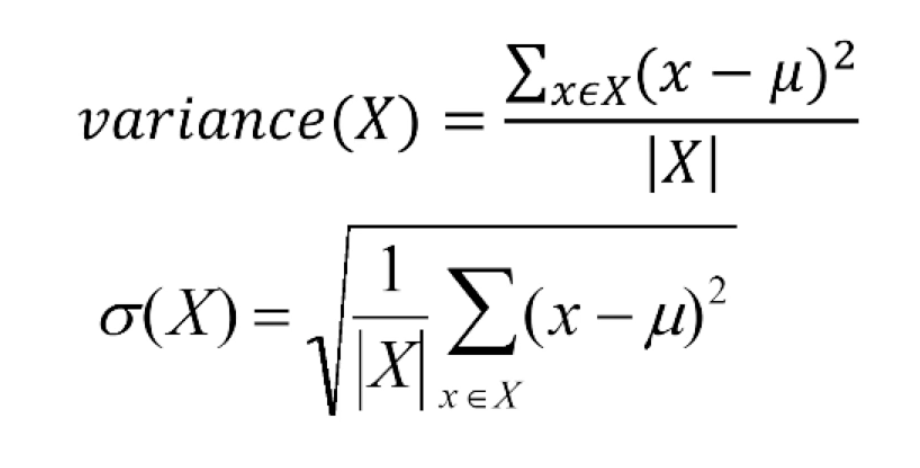
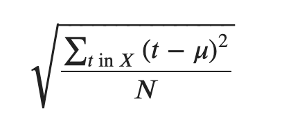
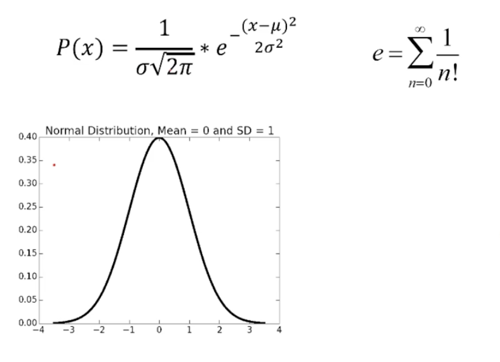
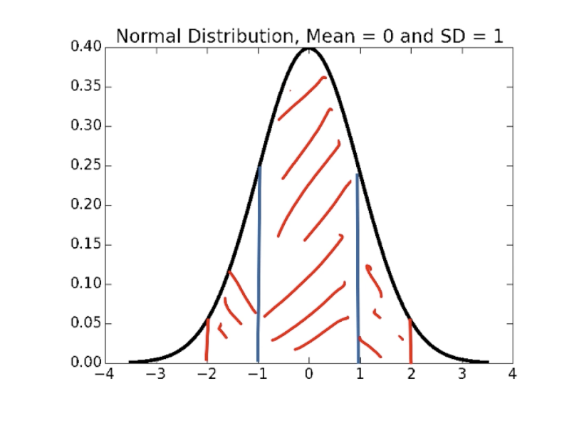
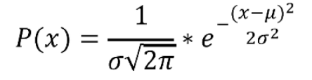

##Unit 3##

###Inferential Statistics###
* Population: a set of examples
* Sample: a proper subset of a population
* Goal: estimate some statcitic about the population based on statistics about the sample
* Key fact: If the sample is **random**, it tends to exhibit the same properties as the population from which it is drawn

**Why the difference in confidence**?
* Confidence in our estimate depends upon two things
	* the size of sample (100 vs 2)
	* variance of sample (all heads versus 52 heads)
* As the variance grows, we need larger samples to have the same degree of confidence

```python
import random

class FairRulette():
	def __init__(self):
		self.pockets = []
		for i in range(1, 37):
			self.pockets.append(i)
		self.ball = None
		self.blackOdds, self.redOdds = 1.0, 1.0
		self.pocketOdds = len(self.pockets) - 1.0

	def spin(self):
		self.ball = random.choice(self.pockets)

	def isBlack(self):
		if type(self.ball) != int:
			return False
		if ((self.ball > 0 and self.ball <= 10)) or (self.ball >18 and self.ball <=28):
			return self.ball % 2 == 0
		else:
			return self.ball % 2 == 1

	def isRed(self):
		return type(self.ball) == int and not self.isBlack()

	def betBlack(self, amt):
		if self.isBlack():
			return amt * self.blackOdds
		return -amt

	def betRed(self, amt):
		if self.isRed():
			return amt * self.redOdds
		return -amt

	def betPocket(self, pocket, amt):
		if str(pocket) == str(self.ball):
			return amt * self.pocketOdds
		return -amt

	def __str__(self):
		return 'Fair Roulette'

def playRoulette(game, numSpins, toPrint = True):
	luckyNumber = '2'
	bet = 1
	toRed, toBlack, toPocket = 0.0, 0.0, 0.0
	for i in range(numSpins):
		game.spin()
		toRed += game.betRed(bet)
		toBlack += game.betBlack(bet)
		toPocket += game.betPocket(luckyNumber, bet)

	if toPrint:
		print(numSpins, ' spins of', game)
		print('Expected return betting red =', str(100 * toRed / numSpins) + '%')
		print('Expected return betting black =', str(100 * toBlack / numSpins) + '%')
		print('Expected return betting ', luckyNumber, '=', str(100 * toPocket / numSpins) + '%')
	return (toRed/numSpins, toBlack/numSpins, toPocket/numSpins)

numSpins = 10000000
game = FairRulette()
playRoulette(game, numSpins)
```
**The Law of Large Numbers** (aka Bernoulli's Law):
* In repeated independent tests with the same actual probability p of a particular outcome in each test, the chance that the fraction of times that outcome occurs differs from p converges to zero as the number of trials goes to infinity.

**Gambler's Fallacy**:
* If deviations from expected behavior occur, these deviations are likely to be evened out by opposite deviations in the future
* Probability of 15 consecutive reds: 1/32,378
* Probability of 25 consecutive reds: 1/33,554,432
* Probability of 26 consecutive reds: 1/67,108,865
* Probability of 26 consecutive reds when previous 25 rolls were red: 1/2
* Gambler's Fallacy is confused with regression to the mean (something that's actually correct)

**Regression to the Mean**:
* Following an extreme random event, the next random event is likely to be less extreme
* If you spin a fair roulette wheel 10 times and get 100% reds, that is an extreme event (probability = 1/1024)
* It is likely that in the next 10 spins, you will get fewer than 10 reds
* So if you look at the average of the 20 spins, it will be closer to the expected mean of 50% reds than to the 100% you saw in the first 10 spins
* First used by Francis Galton, 1885

####Exercise 1####
1. A fair two-sided coin is flipped 4 times. It comes up heads all four times. What is the probability that it comes up heads on the fifth flip? Answer in reduced fraction form - eg 1/5 instead of 2/10.   
**Answer**: 1/2

2. A fair two-sided coin is flipped 1000 times. It comes up heads every time. Which is correct?  
**Answer**: Regression to the mean tells us that the next few tosses will be not as extreme as the first 1000.

3. Next we toss a huge ball with 1,000 dots on it. Half the dots are red and the other half are blue. We roll the ball and when it stops, we note the color of the dot on the very top of the ball.
True or False? If we roll it four times, and it comes up red once and blue three times, then we have proved that the ball is biased.  
**Answer**: False

###Variation in Data###

```python
class EuRoulette(FairRulette):
	def __init__(self):
		FairRulette.__init__(self)
		self.pockets.append('0')
	def __str__(self):
		return "European Roulette"

class AmRoulette(FairRulette):
	def __init__(self):
		FairRulette.__init__(self)
		self.pockets.append('00')
	def __str__(self):
		return "American Roulette"

def findPocketReturn(game, numTrials, trialSize, toPrint):
	pocketReturns = []
	for t in range(numTrials):
		trialVals = playRoulette(game, trialSize, toPrint)
		pocketReturns.append(trialVals[2])
	return pocketReturns

random.seed(0)

numTrials = 20
resultDict = {}
games = (FairRulette, EuRoulette, AmRoulette)

for G in games:
	resultDict[G().__str__()] = []

for numSpins in (100, 1000, 10000, 100000):
	print('\nSimulate betting a pocket for', numTrials, 'trials of', numSpins, 'spins each')
	for G in games:
		pocketReturns = findPocketReturn(G(), numTrials, numSpins, False)

		print('Exp. return for', G(), '=', str(100*sum(pocketReturns)/float(len(pocketReturns))) + '%')
```

Sampling Space of Possible Outcomes
* Never possible to guarantee perfect accuracy through sampling
* Not to say that an estimate is not precisely correct
* How many samples do we need to look at before we can have justified confidence on our answer?
	* Depends upon variability in underlying distribution



Qualifying variation in data:
* Standard deviation simply the square root of the variance
* Outliers can have a big effect
* Standard deviation should always be considered relative to mean
	* If many values are close to the mean, the standard deviation is small
	* If many values are away from the mean, the standard deviation is large
	* If all values are the same, the values will be the mean, so the standard deviation is 0

```python
def getMeanAndStd(X):
	mean = sum(X) / float(len(X))
	tot = 0.0
	for x in X:
		tot += (x - mean)**2
	std = (tot/len(X))**0.5
	return mean, std
```

Confidence levels and intervals:
* Instead of estimating an unknown parameter by a single value (e.g., the mean of a set of trials), a confidence interval provides a range that is likely to contain the unknown value and a confidence that the unknown value lays within that range.
	* E.g.: "The expected return on betting on 2 twenty times Europen roukette is -3.3%. The margin of error is +/- 1 percentage point with a 95% level of confidence." >> 95 percent of the time I will get answer between -2.3% and -4.3%.
* The confidence interval and confidence level indicate the reliability of the estimate.
* Almost always, increasing the confidence level, will widen the confidence interval.

**Empirical Rule**:
* Under some assumptions discussed later:
	* ~ 68% of data within one standard deviation of mean
	* ~ 95% of data within 2 standard deviations of mean
	* ~ 99.7% of data within 3 standard deviations of mean  

The **coefficient of variation** is the standard deviation divided by the mean. Loosely, it's a measure of how variable the population is in relation to the mean.

```python
# Code to test the empirical rule
numTrials = 20
resultDict = {}
games = (FairRulette, EuRoulette, AmRoulette)
for G in games:
	resultDict[G().__str__()] = []
for numSpins in (100, 1000, 10000, 100000):
	print('\nSimulate betting a pocket for', numTrials, 'trials of', numSpins, 'spins each')
	for G in games:
		pocketReturns = findPocketReturn(G(), 20, numSpins, False)
		mean, std = getMeanAndStd(pocketReturns)
		resultDict[G().__str__()].append((numSpins, 100*mean, 100*std))
		print('Exp. return for', G(), '=', str(round(100*mean, 3)) +
			'%,', '+/- ' + str(round(100*1.96*std, 3)) +
			'% with 95% confidence')
```
####Exercise 2####
For the questions below, please try to think about the solution in your head before using an IDE or a calculator to compute it. The goal of these questions is to give you some intuition about the topics we've been discussing.

1. Which of the following populations has the largest variance?  
**Answer**: [0,0,0,3,6,6,6]

2. Which of the following populations has the largest variance?  
**Answer**: [1,5,5,5,9]

3. If a number is removed from a population, the standard deviation of that population will always decrease.  
**Answer**: False

4. You are taking samples of the ages of two populations, A and B. Population A is all the residents of San Francisco, while Population B is all the residents of Los Angeles.  
The sample from Population A has a mean of 35 and a standard deviation of 1. The sample from Population B has a mean of 45 and a standard deviation of 15. Which of the following are certain?  
**Answer**:
* A sample size of 1 million is more appropriate than a sample size of 10 for these populations.
* The average age of the sample of pop A is lower than the average age of the sample of pop B.

5. The 95% confidence interval for a normal distribution of data with a mean of 5 and a standard deviation of 2 is 5 +/- ____? 
**Answer**: (2 std * 1.96) = 3.92

####Exercise 3####
Write a function, stdDevOfLengths(L) that takes in a list of strings, L, and outputs the standard deviation of the lengths of the strings. Return float('NaN') if L is empty.

Recall that the standard deviation is computed by this equation:


where:
* 𝜇  is the mean of the elements in X.  
* ∑𝑡 in 𝑋(𝑡−𝜇)2  means the sum of the quantity  (𝑡−𝜇)2  for t in X.  
* That is, for each element (that we name t) in the set X, we compute the quantity  (𝑡−𝜇)2 . We then sum up all those computed quantities.  
* N is the number of elements in X.  
* Test case: If L = ['a', 'z', 'p'], stdDevOfLengths(L) should return 0.  
* Test case: If L = ['apples', 'oranges', 'kiwis', 'pineapples'], stdDevOfLengths(L) should return 1.8708.  
```python
def stdDevOfLengths(L):
	"""
	L: a list of strings

	returns: float, the standard deviation of the lengths of the strings,
	  or NaN if L is empty.
	"""
	if len(L) == 0:
		return float('NaN')

	mean = len(''.join(L)) / len(L)
	std = 0.0 

	for x in L:
		std += (len(x) - mean)**2

	return (std / len(L))**0.5
```

####Exercise 4####
The coefficient of variation is the standard deviation divided by the mean. Loosely, it's a measure of how variable the population is in relation to the mean.

1. Figure 1 shows the skyline of Pythonland, and Figure 2 shows the skyline of Montyland. Considering the heights of buildings in Pythonland and Montyland, which has a larger coefficient of variation?  
**Answer**: Montyland

2. Which of the following populations has the highest coefficient of variation?  
**Answer**: [1, 2, 3]

3. Compute the coefficient of variation of [10, 4, 12, 15, 20, 5] to 3 decimal places.  
**Answer**: sqrt((1 + (11-4)**2 + 1+ (11-15)**2 + (20-11)**2 + (11-5)**2) / 6) / 11 = 0.503

###Distributions###
**Empirical Rule**:
* ~ 68% of data within one standard deviation of mean
* ~ 95% of data within 1.96 standard deviations of mean
* ~ 99.7% of data within 3 standard deviations of mean
* Two key assumptions:
	* The mean estimation error is zero
	* The distribution of the errors in the estimates is normal

**Defining Distributions**:
* Normal distribution aka Gaussian distribution (bell shaped curve).
* Use a probability distribution
* Captures notion of relative frequency with which a random variable takes a certain value
	* Discrete random variables drawn from finite set of values
	* Continuous random variables drawn from reals between two numbers (i.e., infinite set of values)
* For discrete variable, simply list the probability o each value, must add up to 1
* Continuous case trickier, can't enumerate probability for each of an infinite set of values

**PDF's**:
* Distributions defined by probability density functions (PDFs)
* Probability of a random variable lying between two values
* Defines a curve where the values on the x-axis lie between the minimum and maximum value of the variable
* Area under the curve between two points, is probability of example falling within the range

**Normal Distribution**:

_Normal distributions peak at the mean and fall off symmetrically above and below the mean and asymptotically approach 0._ The normal distribution can be specified by two parameters, the mean and the standard deviation. Knowing these two values is equivalent to knowing the entire normal distribution.

**Why do we like normal distributions?**
* Nice mathematical properties
* Occur a lot!

```python
# Generating Normal Distributions
dist = []
for i in range(1000000):
	dist.append(random.gauss(0, 30)) # mean 0 and std 30
pylab.hist(dist, 30)
# This is not a continuous normal distribution but a discrete approximation because I did not generate an infinite number of points
```

**Looks like the Empirical Rule holds**:


#### SciPy Library ####
* SciPy library contains many useful mathematical functions used by scientists and engineers
* scipy.integrate.quad has up to four arguments
	* a function or method to be integrated
	* a number representing the lower limit of the integration
	* a number representing the upper limit of the integration
	* an optional tuple supplying values for all arguments, except the first, of the function to be integrated
* scipy.integrate.quad returns a tuple
	* Approximation to result
	* Estimate of absolute error

```python
import random
import scipy.integrate
import pylab

def gaussian(x, mu, sigma):
	# SEE PICTURE BELOW
	factor1 = (1.0 / sigma*((2*pylab.pi)**0.5))
	factor2 = pylab.e**-(((x-mu)**2)/(2*sigma**2))
	return factor1*factor2

def checkEmpirical(numTrials):
	for t in range(numTrials):
		mu = random.randint(-10, 10)
		sigma = random.randint(1, 10)
		print('For mu =', mu, 'and sigma =', sigma)
		for numStd in (1, 1.96, 3):
			area = scipy.integrate.quad(gaussian, mu-numStd*sigma, mu+numStd*sigma, (mu, sigma))[0]
			print(' Fraction with', numStd, 'std =', round(area, 4))
		print('\n')
```


**BUT** not all distributions are normal. For example, the outcomes of spins of roulette wheel are uniformally distributed (each outcome is equally probable).

####Exercise 5####
In the lecture, you saw a uniform and a normal distribution. There is another type of distribution, called an exponential distribution. For the following real-life situations, fill in the blank with the appropriate distribution model (normal, uniform, or exponential) that would best simulate the situation.

1. Rolling a fair 6-sided die  
**Answer**: uniform

2. Sum of rolling 2 fair 6-sided dice  
**Answer**: normal

3. Women's shoe sizes  
**Answer**: normal

4. Human intelligence (IQ) scores  
**Answer**: normal

5. Amount of mold on bread, assuming an infinite supply of bread  
**Answer**: exponential

6. The winning lottery numbers  
**Answer**: uniform

7. Skilled person throwing darts at a dart board  
**Answer**: normal

8. Radioactive decay (time between successive atom decays)  
**Answer**: exponential

####Exercise 6####
1. Samples were taken from a distribution, and the histogram of those samples is shown here:... Which of the following distributions were the samples taken from?  
**Answer**: normal

2. Which of the following histograms best matches samples taken from a uniform distribution between 0 and 2?  
**Answer**: Figure 2

3. Each of the following histograms was generated by sampling a different normal distribution. Which histogram best matches the normal distribution with the highest variance of the three?  
**Answer**: Figure 3

4. Mary's Clothes Shoppe is a moderately busy store. Which of the following histograms best matches observations of how much time (in minutes) there is between customer arrivals? That is, which histogram helps best predict how much time until the next customer comes into the Clothes Shoppe.
For each histogram, 1000 observations were made. The x-axis is measured in minutes, and the height of each bar at minute m corresponds to how many times there was an m minute wait until the next customer arrived.  
**Answer**: Figure 1