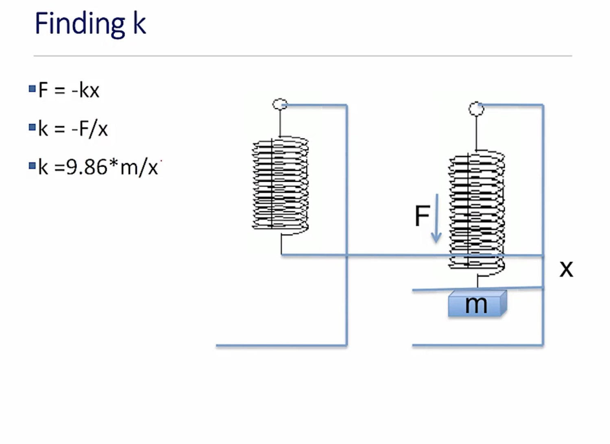
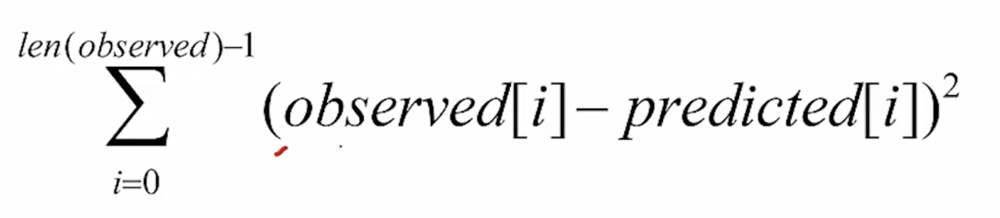
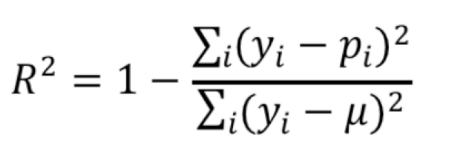

## Unit 4 ##

### Experimental Data ###

Statistics meets experimental science:
* Conduct an experiment to gather data
	* Physical (e.g., in a biology lab)
	* Social (e.g., questionnaires)
* Use theory to generate some questions about data
	* Physcial (e.g., gravitational fields)
	* Social (e.g., people give inconsistent answers)
* Design a computation to help answer questions about data

*Linear spring*: amount of force needed to stretch or compress spring is linear in the distance the spring is stretched or compressed.
* each spring has a spring constant k, that determines how much force is needed

**Hooke's Law**:
* `F = -kd`
* How much does a rider have to weigh to compress spring 1cm?
* E.g.: `F = 0.01m * 35,000 N/m = 350 N` =>
* `F = mass * acc = mass * 9.8 m/s^2` =>
* `mass = 350N / (9.81 m/s^2)` =>
* `mass ~ 35.68k`



Fitting Curves to Data:
* When we fit a curve to a set of dara, we are finding a fit that relates an independent variable (the mass) to an estimated value of a dependent variable (the distance).
* We need to define an objective function that provides a quantitative assessment of how well the curve fits that data.
* Finding the best fit can be formulated as finding the curve that minimizes the value of that function.
* Intuitively, you want to find a line, such that the space between the line and the observed points is minimized.

**Least Square Objective Function**:
* 
* the difference between observed and predicted is often called the residual
* if we minimize the residual, then we minimize the variance

#### Exercise 1 ####
Using the formula derived in this segment, compute k from the second experimental observation: m = 0.15 kg, x = 0.1015 m. Use 9.81 m/s^2 as the gravitational constant (g). Enter your answer to at least 1 decimal place of accuracy.  
**Answer**: 14.5

### Fitting a Model to Data ###
* Use linear regression to find a polynomial
* We will use a degree-one polynomial, `y=ax + b` as model of our data (we want a line)
* Find values of a and b such that when we use the polynomial to compute y values for all of the x values in our experiment, the squared difference of these values and the corresponding observed values is minimized.
* A **linear regression** problem
* Many algorithms for doing this, including one similar to Newton's method (shown in 6.00.1x)

Polynomials with one variable (x):
* 0 or sum of finite number of non-zero terms
* each term of the form `cx^p`
	* c, the coefficient, a real number
	* p, the degree of the term, a non-negative integer
* the degree of the polynomial is the largest degree of any term
* Examples:
	* line: `ax + b`
	* parabola: `ax^2 + bx + c`

polyFit
* `pylab.polyfit(observedX, observedY, n)`
* Finds coefficients of a polynomial of degree n, that provides a best least squares fit for the observed data
```python
def fitData(fileName):
	xVals, yVals = getData(fileName)
	xVals = pylab.array(xVals)
	yVals = pylab.array(yVals)
	xVals = xVals * 9.81 # get force
	pylab.plot(xVals, yVals, 'bo', label = 'measured points')
	labelPlot()

	a, b = pylab.polyfit(xVals, yVals, 1)
	estYVals = a * pylab.array(xVals) + b
	print('a =', a, 'b =', b)
	pylab.plot(xVals, estYVals, 'r', label = 'Linear fit, k =' + str(round(1/a, 5)))
	pylab.legend(loc = 'best')
```

Version using polyval:
```python
def fitData1(fileName):
	xVals, yVals = getData(fileName)
	xVals = pylab.array(xVals)
	yVals = pylab.array(yVals)
	xVals = xVals * 9.81 # get force
	pylab.plot(xVals, yVals, 'bo', label = 'Measured points')
	labelPlot()
	model = pylab.polyfit(xVals, yVals)
	estYVals = pylab.polyval(model, xVals)
	pylab.plot(xVals, estYVals, 'r', label = 'Linear fit, k =' + str(round(1/model[0], 5)))
	pylab.legend(loc = 'best')
```

Higher degree models:
```python
model2 = pylab.polyfit(xVals, yVals, 2)
pylab.plot(xVals, pylab.polyval(model2, xVals), 'r--', label = 'Quadratic Model')
```

#### Exercise 2 ####
Which of the following lines will fit a parabola to the spring data given in the lecture file, springData.txt? Check all that work.  
**Answer**: 
* model = pylab.polyfit(xVals, yVals, 2)
* a,b,c = pylab.polyfit(xVals, yVals, 2)

Suppose the coefficients returned by polyval are in the tuple (c1, c2, c3). Which of the following lines calculate the estimated y values?  
**Answer**: estYVals = c1 * xVals ** 2 + c2 * xVals + c3

### Goodness of Fit ###

How good are these fits:
* Relative to each other
* In an absolute sense

Relative to each other:
* Fit is a function from the independent variable to the dependent variable 
(equivalent to asking about the accuracy of these estimations)
* Given an independent value, provides an estimate of the dependent value
* Which fit provides better estimates

Comparing Mean Squared Error:
```python
def aveMeanSquareError(data, predicted):
	error = 0.0
	for i in range(len(data)):
		error += (data[i] - predicted[i])**2
	return error/len(data)

estYVals = pylab.polyval(model1, xVals)
print('Ave mean square error for linear model =', aveMeanSquareError(yVals, estYVals))
estYVals = pylab.polyval(model2, xVals)
print('Ave mean square error for quadratic model =', aveMeanSquareError(yVals, estYVals))
```

In an Absolute Sense:
* Mean square error useful for comparing two different models for the same data
* Useful for getting a sense of absolute goodness of fit?
	* Is 1524 good?
* Hard to know, since there is no upper bound and not scale independent
* Instead we use **coefficient of determination**, R^2 
	* {y_i} is actual value
	* {p_i} is predicted value
	* {mu} is the mean
	* Think of the numerator as the amount of error in the estimates
	* Think of the denominator as capturing the variability in the estimates, how much they differ from the mean

```python
def rSquared(observed, predicted):
	error = ((predicted - observed)**2).sum()
	meanError = error/len(observed)
	return 1 - (meanError/numpy.var(observed))
```

R^2:
* By comparing the estimation error (the numerator) with the variability of the original values (the denominator), R^2 is intended to capture the proportion of variability in a data set that is accounted for by the statistical model provided by the fit.
* If the dataset is highly variable, then it's harder to model it, if it's very constant, it's easier to model it
* Always between 0 and 1 when fit generated by a linear regression and tested on training data
* If R^2 = 1, the model explains all the variability in the data. If R^2 = 0, there is no relationship between the values predicted by the model and the actual data. If R^2 = 0.5, the model explains half the variability in the data

```python
def genFits(xVals, yVals, degrees):
	models = []
	for d in degrees:
		model = pylab.polyfit(xVals, yVals, d)
		models.append(model)
	return models

def testFits(models, degrees, xVals, yVals, title):
	pylab.plot(xVals, yVals, 'o', label = 'Data')
	for i in range(len(models)):
		estYVals = pylab.polyval(models[i], xVals)
		error = rSquared(yVals, estYVals)
		pylab.plot(xVals, estYVals, label = 'Fit of degree ' + str(degrees[i]) + ', R2 = ' + str(round(error, 5)))
		pylab.legend(loc = 'best')
		pylab.title(title)

xVals, yVals = getData('mysteryData.txt')
degrees = (1, 2)
models = genFits(xVals, yVals, degrees)
testFits(models, degrees, xVals, yVals, 'Mystery data')

### Compare higher-order fits
xVals, yVals = getData('mysteryData.txt')
degrees = (2, 4, 8, 16)
models = genFits(xVals, yVals, degrees)
testFits(models, degrees, xVals, yVals, 'Mystery data')
```
#### Exercise 4 ####

Recall from the previous video the concept of the coefficient of determination, also known as the  𝑅2  value. This is computed by (formula). The variability of the errors is computed by taking the sum of the squares of (observed - predicted) errors. We normalize this variablity by dividing it by the variability of the data, which is sum of the squares of (observation - average_observation) for each observation.
In this file, this  𝑅2  value is computed by the function rSquare.
In that file, revise fitData and fitData3 to report the coefficient of determination for the fitted line in each case. Did this measure of the "goodness of fit" improve when we eliminated the measurements after the spring reached its elastic limit and Hooke's Law no longer applied?  
**Answer**: Yes

### Fits for Datasets ###

Why we build models:
* Help us understand the process that generated the data
	* E.g: the properties of a particular linear spring
* Help us make predictions about out-of-sample data
	* E.g., predict the displacement of a spring when a force is applied to it
	* E.g., predict the effect of treatment on a patient
* A good model helps us do thee things

```python
# How mystery data was generated
def genNoisyParabolicData(a, b, c, xVals, fName):
	yVals = []
	for x in xVals:
		theoreticalVal = a*x**2 + b*x + c
		yVals.append(theoreticalVal + random.gauss(0, 35))
	f = open(fName, 'w')
	f.write('x 		y\n')
	for i in range(len(yVals)):
		f.write(str(xVals[i]) + ' 	 ' + str(yVals[i]) + '\n')
	f.close()

# parameters for generating data
xVals = range(-10, 11, 1)
a, b, c = 3, 0, 0
genNoisyParabolicData(a, b, c, xVals, 'Mystery Data.txt')
```

Let's look at two data sets:
```python
degrees = (2, 4, 8, 16)
random.seed(0)

xVals1, yVals1 = getData('Dataset 1.txt')
models1 = genFits(xVals1, yVals1, degrees)
testFits(models1, degrees, xVals1, yVals1, 'Dataset 1.txt')

pylab.figure()
xVals2, yVals2 = getData('Dataset 2.txt')
models2 = genFits(xVals2, yVals2, degrees)
testFits(models2, degrees, xVals2, yVals2, 'Dataset 2.txt')
```

Hence Degree 16 is Tightest Fit
* What are we looking at is training error
* How well the model performs on the data from which it was learned
* Small training error a necessary condition for a great model, but not a sufficient one
* We want model to work well on other data generated by the same process
	* Measurements for other weights on the spring
	* Voters other than those surveyed
	* Etc.
* It needs to generalize to other data

One way to get some insight into how well a model is likely to generalize is to use **cross-validation**.
* Generate models using one dataset, and then test it on the other
	* Use models for Dataset1 to predict points for Dataset 2
	* Use models for Dataset2 to predict points for Dataset 1
* Expect testing error to be larger than training error
* A better indication of genealizability than training error

```python
# Test code
pylab.figure()
testFits(models1, degrees, xVals2, yVals2, 'Dataset 2/Model 1')
pylab.figure()
testFits(models2, degrees, xVals1, yVals1, 'Dataset 1/Model 2')
```

#### Exercise 1 ####
To model data effectively, it is important to understand the underlying model that describes the data. This means that knowing the physical phenomenon or event that is being modeled is extremely important. For each of the following data/phenomena/events, describe what type of model (linear, quadratic, other) you would use to describe the underlying phenomena.

1. Hourly temperature from 7am to 7pm?  
**Answer**: quadratic

2. Gravitational force on an object as mass increases?  
**Answer**: linear

3. Displacement of a mass on a hanging spring from the ceiling?  
**Answer**: other

4. It is also important to understand physical phenomena and their limitations when modeling data. Which of the following are true?  
**Answer**:
* Even though hourly temperature fluctuations throughout the day may oscillate for a variety of reasons (wind, cloud cover, etc), the underlying trend is quadratic and using a quadratic model is most appropriate.
* At some point, some physical phenomena have limitations that do not fit their mathematical models (i.e. springs have an elastic limit).

5. When modeling, the model that has the biggest R^2 value is always the best model.  
**Answer**: False

### Model Predictions and Overfitting ###

Icreasing the complexity:
* What happens when we increase order of polynomial?
	* Can we get a rose fit to training data? No
* If extra term is useless, coefficient will merely be zero
* But if data is noisy, can fit the noise rather than the underlying pattern in the data
* The higher the degree of the polynomial, the more likely you are to fit the noise.

```python
# Fitting a Quadratic to a Perfect Line
xVals = (0, 1, 2, 3)
yVals = xVals
pylab.plot(xVals, yVals, label = 'Actual values')
a, b, c = pylab.plotfit(xVals, yVals, 2)
print('a =', round(a, 4), 'b =', round(b, 4), 'c =', round(c, 4))
estYVals = pylab.polyval((a,b,c), xVals)
pylab.plot(xVals, estYVals, 'r--', label = 'Predictive values')
print('R-squared =', rSquared(yVals, estYVals))
```
```python
# Predict another point using same model
xVals = xVals + (20, )
yVals = xVals
pylab.plot(xVals, yVals, label = 'Actual values')
estYVals = pylab.polyval((a,b,c), xVals)
pylab.plot(xVals, estYVals, 'r--', label = 'Predictive values')
print('R-squared = ', rSquared(yVals, estYVals))
```
```python
xVals = (0, 1, 2, 3)
yVals = (0, 1, 2, 3.1)
pylab.plot(xVals, yVals, label = 'Actual values')
model = pylab.polyfit(xVals, yVals, 2)
print(model)
estYVals = pylab.polyval(model, xVals)
pylab.plot(xVals, estYVals, 'r--', label = 'Predicted values')
print('R-squared =', rSquared(yVals, estYVals))
```

```python
# Predict another point using same model
xVals = xVals + (20, )
yVals = xVals
estYVals = pylab.polyval(model, xVals)
print('R-squared = ', rSquared(yVals, estYVals))
pylab.figure()
pylab.plot(xVals, estYVals)
```

The take home message:
* Choosing an over-complex model **can** leads to **overfitting** to the training data
* Increases the risk of a model that works poorly on data not included in the training set
* On the other hand choosing an insufficiently complex model has other problems
	* As we saw when we fit a line to data that was basically parabolic

#### Exercise 2 ####
Suppose you are given the following data and are asked to fit a curve to this data.
```python
A = [1,2,3,4,5,6,7,8,9,10]
L = [0.59,18.38, 33.01, 54.14, 72.48, 89.8, 97.07, 112.6, 142.87, 199.84]
```

1. Match each plot with the correct polynomial fit.  
**Answer**:
* 1 - Linear
* 2 - Polynomial of degree 2
* 3 - Polynomial of degree 5

2. Is each fit an example of overfitting?  
**Answer**:
* 1 - No
* 2 - No
* 3 - Yes

### Cross-Validation ###

Returning to where we started:
* Remember Hooke: relation between force and distance is linear _up to the elastic limit_
	* Unless we believe theory us wrong, that should guide us
	* Holds up to elastic limit of spring
	* Should probably fit different models to different segments of data, as when the curve flattens, we've probably gone beyond the elastic limit

Suppose we don't have a solid theory
* Use cross-validate results guide the choice of model complexity
* if dataset small, use leave one-out cross validation
* if dataset large enough, use k-fold cross validation or repeated-random-sampling validation

Leave-one-out cross validation:
* let D be the original data set
* do the following code below
* we do this until each example has been left out
* after that we average the test results
```python
testResults = []
for i in range(len(D)):
	training = D[:].pop(i)
	model = buildModel(training)
	testResults.append(test(model, D[i]))
```

K-fold cross validation:
* k-fold very similar to leave-one_out
* D partitioned into k equal size sets
* model trained on k-1, and tested on remaining
* ... average test results

Repeated Random Sampling:
* Let D be the original data set
* Let n be the number of random samples
* do the following pseudo code
```python
testResults = []
for i in range(n): # n can be in the order of 100
	randomly partition D into two sets:
		training and test # follow 20-80 rule
	model = buildModel(training)
	testResults.append(test(model, test))
Average test results
```

An example, temperature by year:
* Task: model how the mean daily high temperature in the US varied from 1961 through 2015
* Get means for each year and plot them
* Randomly divide data in half n times
	* For each dimensionality to be tried
		* Train on one half of data
		* Test on the other half
		* Record r-squared on test data
* Report mean r-squared for each dimensionality

```python
class tempDatum(object):
	def __init__(self, s):
		info = s.plit(', ')
		self.high = float(info[1])
		self.year = int(info[2][:4])
	def getHigh(self):
		return self.high
	def getYear(self):
		return self.year

def getTempData():
	inFile = open('temperature.csv')
	data = []
	for l in inFile:
		data.append(tempDatum(l))
	return data

def getYearlyMeans(data):
	years = {}
	for d in data:
		try:
			years[d.getYear()].append(d.getHigh())
		except:
			years[d.getYear()] = [d.getHigh()]
	for y in years:
		years[y] = sum(years[y])/len(years[y])
	return years

data = getTempData()
years = getYearlyMeans(data)
xVals, yVals = [], []
for e in years:
	xVals.append(e)
	yVals.append(years[e])
pylab.plot(xVals, yVals)
pylab.xlabel('Year')
pylab.ylabel('Mean Daily High (C)')
pylab.title('Select U.S. Cities')


def splitData(xVals, yVals):
	toTrain = random.sample(range(len(xVals)), len(xVals)//2) # sample indecies
	trainX, trainY, testX, testY = [], [], [], []
	for i in range(len(xVals)):
		if i in toTrain:
			trainX.append(xVals[i])
			trainY.append(yVals[i])
		else:
			testX.append(xVals[i])
			testY.append(yVals[i])
	return trainX, trainY, testX, testY

numSubsets = 10
dimensions = (1, 2, 3)
rSquared = {}

for f in range(numSubsets):
	trainX, trainY, testX, testY = splitData(xVals, yVals)
	for d in dimensions:
		model = pylab.polyfit(trainX, trainY, d)
		estYVals = pylab.polyvar(model, trainX)
		estYVals = pylab.polyvar(mode, testX)
		rSqaured[d].append(rSquared(testY, estYVals))

print('Mean R-squared for test data')
for d in dimensions:
	mean = round(sum(rSquared[d])/len(rSquared[d]), 4)
	sd = round(numpy.std(rSquared[d]), 4)
	print('For dimensionality', d, 'mean =', mean, 'Std =', sd)
print(rSquared[1])
```

Wrapping up curve fitting
* We can use linear regression to fit a curve to data
	* Mapping from independent values to dependent values
* That curve is a model of the data that can be used to predict the value associated with independent values we haven't seen (out of sample data)
* R-squared used to evaluate model
	* Higher not always "better" because of risk of over fitting
* Choose complexity of model based on:
	* Theory about structure of data
	* Cross validation
	* Simplicity