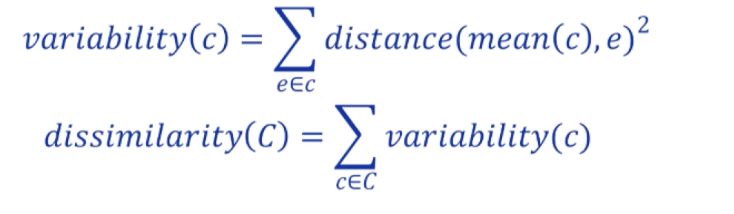

## Unit 5 ##

### Machine Learning ###
* Many useful programs learn something
* In the last two 6.00.2x lectures we used linear regression to learn models of data
* "Field of study that gives computers the ability to learn without being explicitly programed." Arthur Samuel.

What is machine learning?
* Modern statistics meets optimization


How are things learned?
* Memorization
	* Accumulation of individual facts
	* Limited by
		* Time to observe facts
		* Memory to store facts
* Generalization
	* Deduce new facts from old facts
	* Limited by accuracy of deduction process
		* Essentially a predictive activity
		* Assumes that the past predicts the future

Basic paradigm:
* observe set of examples: training data (represents incomplete information)
* infer something about process that generated that data 
* use inference to make predictions about previously unseen data: test data

All ML methods require:
* Represenation of the features
* Distance metric for feature vectors
* Objective function and constraints
* Optimization method for learning the model
* Evaluation method
	* We need to know whether we should put any faith in the model
	* Also, we use these evaluation methods to tune the parameters of the learning method

**Supervised learning**:
* Start with set of feature vector/value pairs
* Goal: find a model that predicts a value for a previously unseen feature vector
* Regression model predict a real number
	* As with linear regression
* Classification models predict a label (chosen from a finite set of labels)

**Unsupervised learning**:
* Start with a set of feature vectors (no labels!)
* Goal: uncover some latent structure in the set of feature vectors
* Clustering: the most common technique
	* Define some metric that captures how similar one feature vector is to another
	* Group examples based on this metric

Choosing features:
* Features never fully describe the situation
* Feature enginnering
	* Represent examples by feature vectors that will facilitate generalization
	* Suppose I want to use 100 examples from past to predict which students will pass the final exam
	* Some features surely helpful, e.g., their grade on the midterm, did they do the problem sets, etc.
	* Others might cause me to overfit, e.g., birth month
* Want to maximize ratio of useful input to irrelevant input
	* Signal-to-noise ratio (SNR)

#### Exercise 1 ####
For the following problems, decide whether it would be better to perform supervised or unsupervised learning given the data.

1. 100,000 emails are read and marked as spam or not spam, depending on some metrics measured on their content(keywords, length, etc). We want to determine what a new email will be marked as.  
**Answer**: Supervised

2. A junkyard has 500 objects with 2 and 4 wheels. We want to separate the objects into 4 different groups.  
**Answer**: Unsupervised

3. A group of 1000 students are asked for a sample of their handwriting. Researchers make pairs of (handwritten text, typed text). Given a new handwriting sample from a new student, we want to determine what the typed version of the handwriting sample would be.  
**Answer**: Supervised

4. Given a set of t-shirts, we want to organize them in 3 different piles.  
**Answer**: Unsupervised

5. Given a greenhouse full of plants, we want to organize them so that they can be given away to novice, intermediate, and expert plant handlers.  
**Answer**: Unsupervised

6. Given a set of colored points on an x-y axis, we want to place a new point on the plot, knowing its color.  
**Answer**: Supervised

7. A school documents the age, grade, score on a math standardized test, and score on a writing standardized test for every student. A new student comes to the school and we want to decide what grade they should be placed in.  
**Answer**: Supervised

### K-Nearest Neighbors ###
Distance between vectors:
* Minkowski metric: 


```python
# Producing the distance matrix
columnLabels = []
for a in animals:
	columnLabels.append(a.getName())
rowLabels = columnLabels[:]
tableVals = []

# Get distances between pairs of animals

# for each row
for a1 in animals:
	row = []
	# for each column
	for a2 in animals:
		if a1 == a2:
			row.append('--')
		else:
			distance = a1.distance(a2)
			row.append(str(round(distance, precision)))
	tableVals.append(row)

# Producing the table
table = pylab.table(rowLabels = rowLabels, colLabels = columnLabels, cellText = tableVals, cellLoc = 'center', colWidths = [0.138]*len(animals))
table.auto_set_font_size(False)
table.set_fontsize(10)
table.scale(1, 2.5)
pylab.axis('off')
pylab.savefig('distances')
```

Uinsg distance matrix for classification:
* Simplest approach is probably nearest neighbor
* Remember training data
* When predicting the label of a new example
	* Find the nearest example in the training datra
	* Predict the label associated with that example

Advantages and disadvantages of KNN:
* Advantages:
	* Learning fast, no explicit training
	* No theory required
	* Easy to explain method and results
* Disadvantages:
	* Memory intensive and predictions can take a long time
		* Are better algorithms than brute force
	* No model to shed light on process that generated data

A more general approach: scaling:
* Z-scaling
	* Each feature has a mean of 0 and standard deviation of 1
* Interpolation
	* Map min value to 0 and max val to 1, and linearly interpolate

```python
def zScaleFeature(vals):
	"""Assumes vals is a sequence of floats"""
	result = pylab,array(vals)
	mean = float(sum(result))/len(result)
	result = result - mean
	return result/stdDev(result)

def iScaleFeature(vals):
	"""Assumes vals is a sequence of floats"""
	minVal, maxVal = min(vals), max(vals)
	fit = pylab.polyfit([minVal, maxVal], [0, 1], 1)
	return pylab.polyval(fit, vals)
```

#### Exercise 2 ####
For the following question, check the boxes that correspond to the rules that we may be able to learn. Consider the following set of 6 emails, which classify the email as spam or not. Which of the following rules might we learn? Check all that apply.

**Answer**:
* Emails containing both flagged words "cash" and "free" are marked "spam".
* Emails containing at least one flagged word in all capital letters are marked "spam".

#### Exercise 3 ####
For each of the following situations state whether it would be a good idea to scale the features.

1. One feature set is height (in meters) and the other is weight (in kilograms).  
**Answer**: Scale

2. One feature set is the number of detected earthquakes in a city and the other is the population in that city.  
**Answer**: Scale

3. The percent concentration of a virus in a random sampling of healthy and unhealthy people.  
**Answer**: Don't scale

4. The angle of refraction of light (degree that light bends) observed when entering water vs. glass vs a diamond.  
**Answer**: Don't scale

### Clustering ###
* Partition examples into groups (clusters) such that examples in a group are more similar to each other than to examples in other groups
* Unlike classification, there is no typically a "right answer"
	* Answer dictated by feature vector and distance metric, not by a ground truth label

Optimization problem:

* Why not divide variability by size of cluster?
	* Want an objective function that penalizes big incoherent clusters more than it penalizes small incoherent clusters. Big and bad worse than small and bad
* Is optimization problem finding a C that minimizes dissimilarity(C)?
	* No, otherwise could put each example in its own cluster
* Need a constraint, e.g.,
	* Minimum distance between clusters
	* Number of clusters

K-means clustering:
* Constraint: exactly k non-empty clusters
* Use a greedy algorithm to find an approximation to minimizing objective function

```
# Algorithm
randomly chose k examples as initial centroids  		# centroid, geographical center of that cluster
while true:
	create k clusters by assigning each example to closest centroid
	compute k new centroids by averaging examples in each cluster
	if centroids don't change:
		break
```

Mitigating dependence on initial centroids:
```
best = kMeans(points)
for t in range(numTrials):
	C = kMeans(points)
	if dissimilarity(C) < dissimilarity(best):
		best = C
return best
```

Wrapping up machine learning:
* Use data to build statistical models that can be used to
	* Shed light on system that produced data
	* Make predictions about unseen data
* Supervised learning
* Unsupervised learning
* Feature engineering
* Goal was to expose you to some important ideas
	* Not to get you to the point where you could apply them
	* Much ore detail, including implementations, in text

#### Exercise 4 ####

The company Internet Movies, Inc. has found wide success in their streaming movie business. After many long and successful years of delivering content, they have decided to use machine learning to make their business even more successful. Luckily, they already possess a huge dataset that has grown over years and years of user activity – but they need your help to make sense of it! Answer the following questions

1. Let’s start with a simple case. Assume user Alice is a particularly good member and she makes sure to rate every movie she ever watches on the website. What machine learning approach would be better for the company to use for determining whether she would be interested in a new specific movie?  
**Answer**: Supervised

2. Bob, on the other hand, is not that much into ratings. He does watch a lot of movies, but never takes the time to rate them. For users like Bob, which of the following data can the company use to determine potential interest in a specific movie? Check all that apply.  
**Answer**:
* Metadata of movies: actors, director, genre, etc.
* Popularity of the movie amongst other users

3. What machine learning approach should the company use for cases like Bob?  
**Answer**: Unsupervised

Now that the company has some idea about how to use the data, it’s time to design a classifier. Our classifier will be very simple: given a movie and a user, it will classify the movie as either "Good" or "Bad" for this user.

4. Assume all the users of the company have a very simple rule in their movie taste: they like it if Tom Cruise has the lead role. Any other data is mostly irrelevant. However, no one in the company knows about this fact. Which of the following clustering models might be able to detect this rule? Check all that apply.  
**Answer**: 
* Unsupervised, with data: Lead role, movie length, rating
* Supervised (label: rating), with data: Movie length, lead role, director 

5. Looking at the options they’re given, the board members choose to go with a supervised model with lead role as data. You become outraged. "How can you not include movie length? It’s incredibly important! Who watches a 3 hour long movie --" Your fellow data scientist interrupts you. "Yeah, I agree, but look at these initial results. You see, if we remove movie length, ..." What can your colleague (correctly) say to convince you? Check all that apply.  
**Answer**: 
* "we can reduce intra-cluster dissimilarity."
* "we can consume less memory, and the results look almost the same."

#### Exercise 5 ####

As Professor Guttag said, there are two types of people in this world: those who know programming and those who don’t. To prove this once and for all, you take a random sampling of edX students and put them through a programming test. Assume that the test is entirely fair and that it reflects the exact level of skill each student has. You also ask them to fill out a small questionnaire about their experience with 6.00.2x.

You receive the results for each student as [Exam grade, Hour spent on 6.00.2x]. That is, if Alice has spent 90 hours on 6.00.2x and received a score of 74 on the exam, you will have [74, 90] as a data point.

1. Based on your initial purposes, what should you choose as k?  
**Answer**: 2

2. Should you apply scaling to this data?  
**Answer**: yes

3. You don’t know what to believe (and, indeed, there’s no reason for you to choose one over another). What can you do to fix this and get a stable result?  
**Answer**: Let k = 3